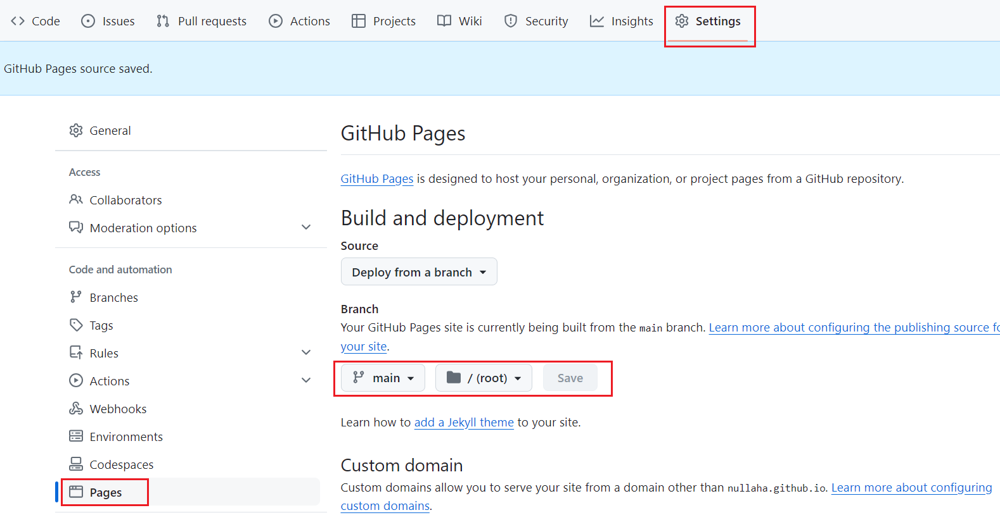
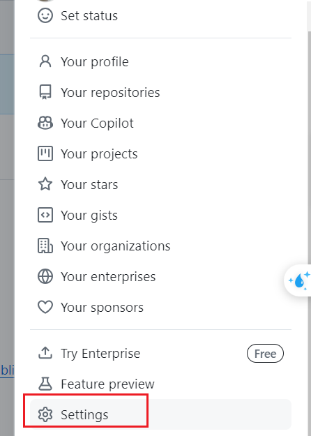
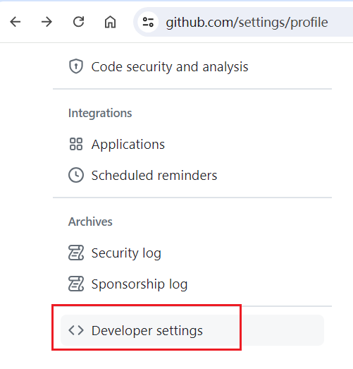
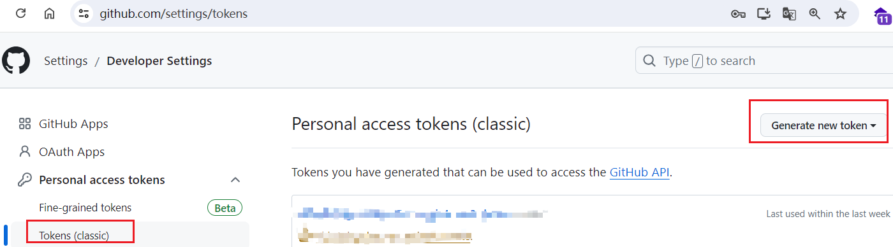
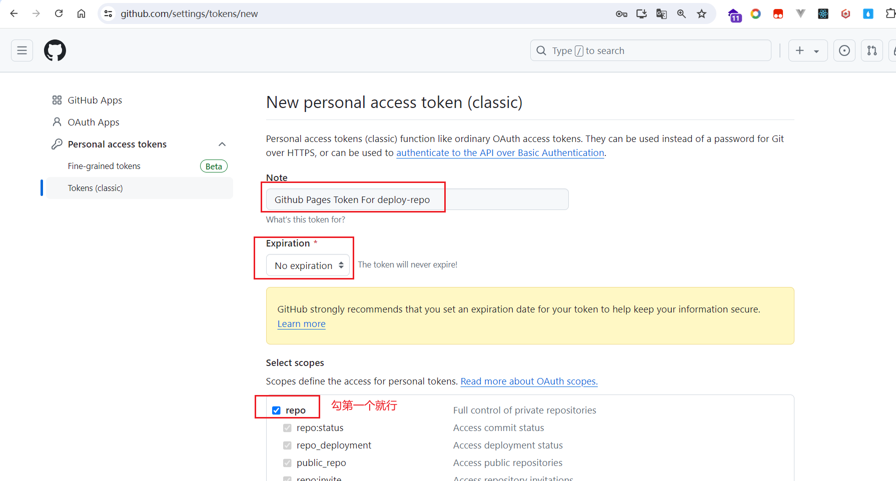
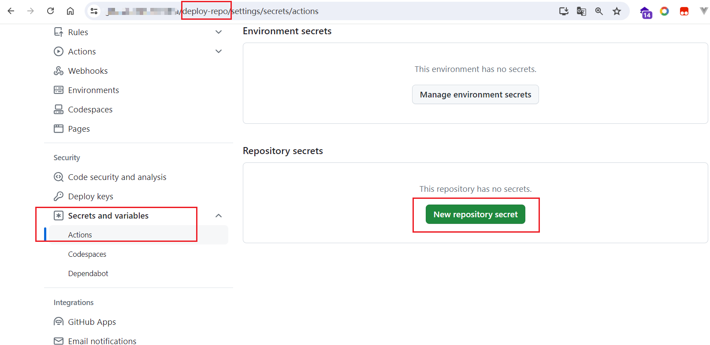
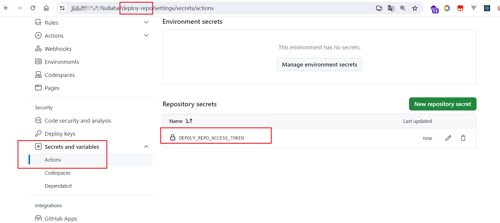

## 1  

[参考：github 自动化部署到github pages](https://blog.csdn.net/weixin_43233914/article/details/134174562)  

### 需求  

我有一个公开的 demo 仓库  

我希望通过 `http://xxx.github.io/demo` 地址能访问到我的demo项目  

每当我push代码到demo仓库的main分支时，我希望demo仓库能自动部署到github pages上  

那么我需要一个action  
（打包该仓库的main分支，文件放到gh-pages分支上）

action里面用到 token

### 实现  

#### 设置该仓库的pages  

  


#### 设置仓库的action secret  

[参考：设置仓库的action secret](https://sauljwu.github.io/pages/d6f511/#%E7%94%9F%E6%88%90github-token)
[参考：设置仓库的action secret2](https://blog.csdn.net/HW140701/article/details/119699169)


自动化部署需要action secret   

创建一个github token  
  

  

  

要使用令牌从命令行访问仓库，就选 repo（仓库）。
  

创建后，不要关闭！要复制token。不然下次就没有了。  

回到deploy-repo仓库，设置actions secret  

  

  

  

#### 创建action

项目根目录创建文件 .github/worflows/deploy.yml  

```yml 

name: Deploy to GitHub Pages

on:
  push:
    branches:
      - main # 监视的分支
    # Review gh actions docs if you want to further define triggers, paths, etc
    # https://docs.github.com/en/actions/using-workflows/workflow-syntax-for-github-actions#on

permissions:
  contents: write

jobs:
  deploy:
    name: Deploy to GitHub Pages
    runs-on: ubuntu-latest
    steps:
      - uses: actions/checkout@v3
      - uses: actions/setup-node@v3
        with:
          node-version: 20
          cache: npm

      - name: Install dependencies
        run: npm ci
      - name: Build website
        run: npm run build

      # Popular action to deploy to GitHub Pages:
      # Docs: https://github.com/peaceiris/actions-gh-pages#%EF%B8%8F-docusaurus
      - name: Deploy to GitHub Pages
        uses: peaceiris/actions-gh-pages@v3
        with:
          github_token: ${{ secrets.ACCESS_TOKEN }}  # 这就是我们上一步设置的action secret
          # Build output to publish to the `gh-pages` branch:
          publish_dir: ./build
          # The following lines assign commit authorship to the official
          # GH-Actions bot for deploys to `gh-pages` branch:
          # https://github.com/actions/checkout/issues/13#issuecomment-724415212
          # The GH actions bot is used by default if you didn't specify the two fields.
          # You can swap them out with your own user credentials.
          user_name: github-actions[bot]
          user_email: 41898282+github-actions[bot]@users.noreply.github.com
```

---  

## 2
### 需求

我有一个私有的 demo2 仓库  

~~我希望通过 `http://xxx.github.io/demo2` 地址能访问到我的demo2项目~~

因为是私人仓库，所以无法直接部署到github pages上。  

所以做不到通过 `http://xxx.gitub.io/<repo name>` 来访问。  

那么我可能需要一个部署仓库 deploy-repo  

每当我push代码到 demo2 仓库的main分支时，我希望 demo2 仓库能自动将打包后的文件 push 到部署仓库的gh-pages分支上  

然后通过 `http://xxx.github.io/deploy-repo/demo2` 来访问。

### 实现  

我有一个 deploy-repo 部署仓库   

#### 设置部署仓库的pages  

#### 设置部署仓库的action secret   

#### 创建action

项目根目录创建文件 .github/worflows/deploy.yml   

```yml 

```

---  

## 注意  

仓库的pages地址可以改吗?  

可以通过自定义域名 或者 修改仓库名来实现。  

私有仓库无法发布到pages?  

是的  

但是可以弄一个 部署仓库  来处理  

[参考：公仓放网页部署后的码，另一个私仓放源码](https://myoontyee.github.io/article/b3031f8a.html)  


 
