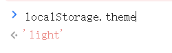

## 切换主题的同时切换pages页面的主题?   

### 思路  


#### 怎么去拿docusaurus主题这个值? 

  

#### antd如何修改主题?  

[Ant Design V5 如何使用暗黑主题](https://juejin.cn/post/7242284648021164091?from=search-suggest)  


### 实现  

```js title='useAntdTheme.ts'
// 让antd样式随页面主题变化而变化

import { useEffect, useState } from 'react';
import { theme as antdTheme} from "antd";

const useAntdTheme = () => {
    // darkAlgorithm   defaultAlgorithm
    const [curThemeStr, setCurThemeStr] = useState('defaultAlgorithm')

    useEffect(() => {
      const handleThemeChange = () => {
        const themePreference = localStorage.getItem('theme'); 
        if (themePreference === 'light') {
          setCurThemeStr('defaultAlgorithm');
        } else {
          setCurThemeStr('darkAlgorithm');
        }
      }
  
      handleThemeChange();
  
      window.addEventListener('storage', handleThemeChange);
      return () => window.removeEventListener('storage', handleThemeChange);
    },[])

    return {
      curTheme: antdTheme[curThemeStr]
    }
}

export default useAntdTheme;

```


```js title='xx.tsx'
import { ConfigProvider } from "antd";
// hooks
import useAntdTheme from '@site/src/hooks/useAntdTheme';

export default function Xxxx() {
  const {siteConfig} = useDocusaurusContext();
  const groupedTodos = groupByYearAndMonth(TODO_CONTENT)
  
  const {curTheme} = useAntdTheme();


  return (
    <Layout
      title={`Hello from ${siteConfig.title}`}
      description="Description will go into a meta tag in <head />">

      <ConfigProvider theme={{ algorithm: curTheme }}>
        {/* ... */}
      </ConfigProvider>
      
    </Layout>
  );
}
```
---