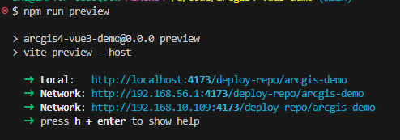
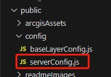
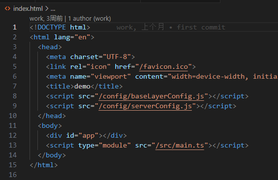

vue + vite

## 配置项目地址  

### 需求  
本地开发时访问项目地址如 `localhost:3000`  

后面接路由如 `localhost:3000/home`  

生产环境时，如果将打包后的dist文件放到了某个文件夹里 访问的地址可能是 `http://192.168.56.1:4173/deploy-repo/arcgis-demo`  

后面接路由如 `http://192.168.56.1:4173/deploy-repo/arcgis-demo/home`  

vite应该如何处理不同的环境变量呢  

### 思路  

根目录下两个文件 .env.production     .env.development  

根据环境不同在vit.config.ts中设置不同的base即可。  


### 开发环境  


### 测试环境/生产环境  

#### 实现  

```js title='.env.production'

VITE_BASE_URL = '/deploy-repo/arcgis-demo' 

```

```ts title='vite.config.ts'

import { defineConfig, loadEnv } from 'vite'

// https://vitejs.dev/config/
export default defineConfig( ({mode}) => {
  // 根据当前工作目录中的 `mode` 加载 .env 文件
  // 设置第三个参数为 '' 来加载所有环境变量，而不管是否有 `VITE_` 前缀。
  const env = loadEnv(mode, process.cwd());
  return {

    base: env?.VITE_BASE_URL, // 更改打包路径
    // ...
  }
})


```
#### 验证  

可以本地 npm run build ,然后 npm run preview 看看  

   

可以看到路径就是我想要的。  


### 注意    

#### 如何在嵌套的公共路径下部署项目?  

问题什么意思?  
就是我不是在`http://192.168.56.1:4173`下部署项目  
而是在`http://192.168.56.1:4173/deploy-repo/arcgis-demo`下部署项目    


只需要指定 base即可。  

[官方文档：公共基础路径](https://cn.vitejs.dev/guide/build#public-base-path)  
[官方文档：base](https://cn.vitejs.dev/config/shared-options#base)  


#### vite.config.ts中怎么拿.env里的环境变量呢?  

[官方文档：在配置中使用环境变量](https://cn.vitejs.dev/config/#using-environment-variables-in-config)

#### vite.config.ts中怎么判断用哪个环境的变量?  

根据mode判断  

[官方文档：mode](https://cn.vitejs.dev/config/shared-options#mode)   


#### .env里的变量如何使用?   

`import.meta.env.VITE_BASE_URL`  

#### todo  
https://juejin.cn/post/7172012247852515335#heading-1

---

## 其他的动态配置  


### 问题  

在不同环境下部署项目可能需要设置不同的配置, 比如不同的接口地址、地图服务、项目标题等。    

如果直接在代码里写死，就得频繁的改代码。  

### 思路  

就在public文件下创建一个config.ts咯，运维要改随便改咯  

### 解决  

先创建xxxcconfig.ts
   

```ts title='serverConfig.ts'
const serverConfig = {

  // 开发环境后端地址
  SERVICE_URL: 'https://localhost:3000',
  TITLE: '嘿嘿',
}

window.serverConfig = serverConfig;
```

在index.html中引入  

  

---

## 项目中如何使用配置  

### 问题  

不管是public里写的配置文件，还是.env里写的变量。  

使用的时候乱七八糟的  

public里配置文件的使用  serverConfig.TITLE  

.env中变量的使用 import.meta.env.VITE_BASE_URL  

有点乱  

如何统一管理呢  

### 解决  

在项目里创建一个index.ts用来统一处理这些配置 `src/config/index.ts`  

```ts title='src/config/index.ts'

/**
 * .env设置的环境变量
 */
const VITE_ENV = import.meta.env;

// 应用名称
const APPLICATION = 'map_demo';

// 应用路径
const BASE_URL = VITE_ENV?.VITE_BASE_URL;

/**
 * public设置的配置
 */
const SERVER_CONFIG = (window as any).serverConfig;

// 接口地址
const SERVICE_URL = SERVER_CONFIG?.SERVICE_URL;

// ArcGIS API静态资源所在目录 ???  


export {
  BASE_URL,
  SERVER_CONFIG
  SERVICE_URL,
  APPLICATION,
};

```

```ts title='使用.ts'
import {BASE_URL} from '@/config'

```


---

