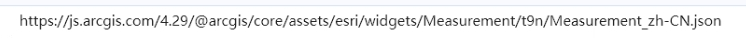
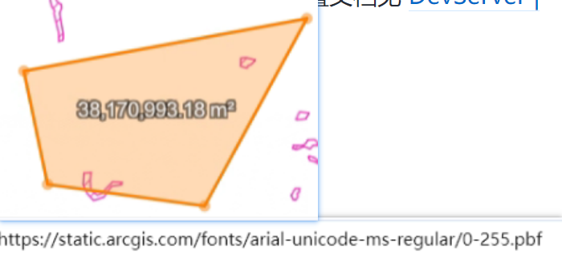
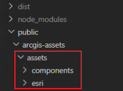
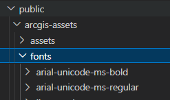
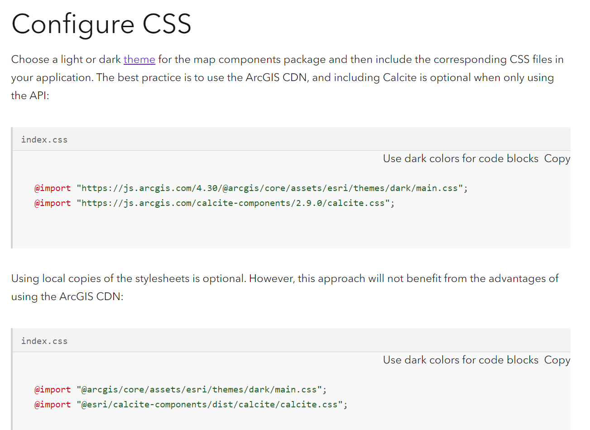

[参考：arcgis js + webpack 完全本地化部署流程](https://juejin.cn/post/7187700867582132285)  

## 本地化指什么?  

通过 `npm i @arcgis/core` 安装包来使用。  

但是代码在实际运行中，仍然会去访问在线的arcgis资源，比如样式、字体、assets资源等。

如果项目可以在公网访问，那么访问👆在线资源没什么毛病。  

但是如果项目只能内网部署呢? 那么访问👆在线资源就会有问题, 比如measure的时候不显示字体..。

所以需要把👆在线资源迁移到本地，让项目从本地加载。  

## 需要本地化的资源有?  

### 1 访问在线assets资源  

当我使用Measurement时：  

  

### 2 访问在线fonts资源  

还是使用Measurement时：地图上测量显示的字要请求在线fonts资源。  

  

### 3 访问assets/..../base/theme/light/main.css资源  

我在本地发现 打开项目的时候有4个woff字体报404.  

我在点查加了个 spinner 图标，这个图标来自
,
也报404 找不到图片。  

TODO: 放一个图

## 本地化assets资源?  

[参考：官网assetsPath](https://developers.arcgis.com/javascript/latest/api-reference/esri-config.html#assetsPath)  

   

### 1 方法一：手动复制粘贴  

将`node_modules\@arcgis\core\assets`文件夹整个复制到项目的public文件夹下。  

   

然后在项目中修改esriConfig.assetsPath = ...

(TODO: vue vite ,怎么引用public目录下的资源（开发环境、生产环境）)  

缺点： 增加打包大小。会被改动。可能出现和版本不一致的情况。  

### 2 方法二：  

`npm run dev` `npm run build` 时复制。  

## 本地化本地字体库？  

### 需求：  

内网时，发现measure widget 无法显示测量值， 排查发现是请求在线字体库失败导致。

js api默认使用的字体库是在线的(https://static.arcgis.com/fonts), 如果内网使用呢，所以需要将字体放到本地。  

### 解决：  

#### 1.爬arcgis的字体  

我本来想着用py爬下来，，但是发现fonts直接访问不了额 = = 

#### 1.直接用别人爬的字体

[参考：ArcGIS API for JavaScript如何使用本地的字体库 ](http://zhihu.geoscene.cn/article/3893)  

我将这个[github仓库](https://github.com/swaggyPYang/arcgisapi)里的fonts放到了我项目的public/arcgis-assets/fonts目录下，然后修改js api的引用。  

  

#### 2. 修改fontsUrl
esriConfig.fontsUrl = ARCGIS_API_FONTS_URL;

---

## 本地化 theme main.css  

[参考：论坛里有人有同样的错误-Esri arcgis/core css relative paths](https://community.esri.com/t5/arcgis-javascript-maps-sdk-questions/esri-arcgis-core-css-relative-paths/m-p/1158294)  

[参考：官方Configure CSS](https://developers.arcgis.com/javascript/latest/get-started-npm/#amd-local-build-deprecated)  

  

### 具体操作(vue+vite)  

在项目里加上  `@import "@arcgis/core/assets/esri/themes/light/main.css";`  

还是报错.  

在项目里加上public目录下的它  `@import "/public/arcgis-assets/assets/esri/themes/light/main.css";`  

路径在开发环境没问题。  

路径在打包后绝对会报错吧。  

我做法是在index.html 里加:
<link href="/arcgis-assets/assets/esri/themes/light/main.css"></link>   

（TODO: 这里要引入vue vite 使用public资源的链接）  

