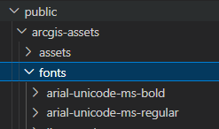

## 使用本地字体库？  

### 需求：  

内网时，发现measure widget 无法显示测量值， 排查发现是请求在线字体库失败导致。

js api默认使用的字体库是在线的(https://static.arcgis.com/fonts), 如果内网使用呢，所以需要将字体放到本地。  

### 解决：  

#### 1.爬arcgis的字体  

我本来想着用py爬下来，，但是发现fonts直接访问不了额 = = 

#### 1.直接用别人爬的字体

[参考：ArcGIS API for JavaScript如何使用本地的字体库 ](http://zhihu.geoscene.cn/article/3893)  

我将这个[github仓库](https://github.com/swaggyPYang/arcgisapi)里的fonts放到了我项目的public/arcgis-assets/fonts目录下，然后修改js api的引用。  

  

#### 2. 修改fontsUrl
esriConfig.fontsUrl = ARCGIS_API_FONTS_URL;

---

