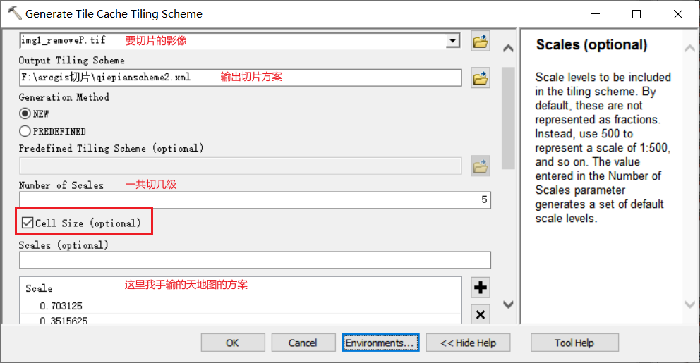
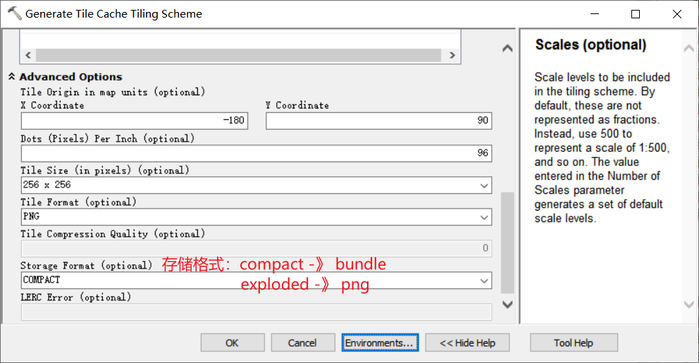
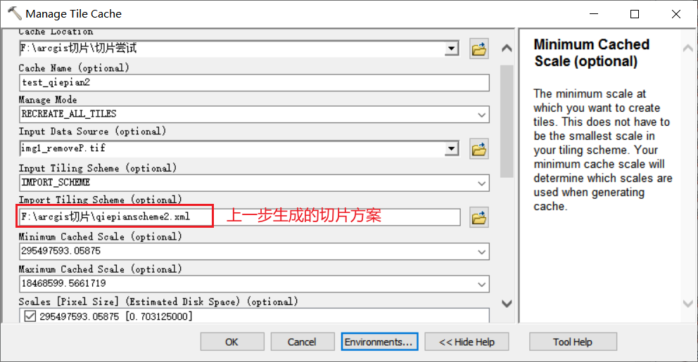
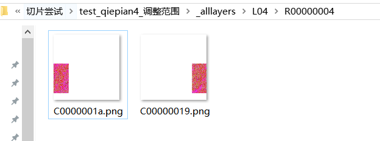

## 需求：

用arcgis将tif影像切片，然后在geoserver中发布wmts。  

## 步骤：  

[参考：arcgis 影像切片，不需要发布服务（生成png格式或者.bundle格式都可以）、可不是生成切片包哦](https://blog.csdn.net/yangniceyangyang/article/details/104254494)

### 1 arcmap加载影像图

坐标系什么的都设置好。

### 2 生成切片方案  

ArcToolbox -> Data Management Tools -> Tile Cache -> Generate Tile Cache Tiling Scheme  

  
  


### 3 开始切片

ArcToolbox -> Data Management Tools -> Tile Cache -> Manage Tile Cache  

  


### 4 结果

  


---

## 使用?  

### arcgis/core加载

#### 方式一：用geoserver发布然后使用  

[用geoserver发布然后使用](https://nullaha.github.io//docs/gis/geoserver/geoserver%E5%8F%91%E5%B8%83%E5%9B%BE%E5%B1%82%E6%9C%8D%E5%8A%A1#geoserver-%E5%8F%91%E5%B8%83wmts%E6%9C%8D%E5%8A%A1geoserver-%E5%8F%91%E5%B8%83arcmap%E5%88%87%E7%89%87-) 


#### 方式二：用arcgis server发布然后使用  

TODO: 

#### 方式三：nginx转发使用  

arcmap影像切片，通过nginx转发_alllayers中保存的切片。使用arcgis for js4 加载该切片。用WebTileLayer类，但是需要根据level，row，col，来获取该切片的nginx里的地址，所以是要修改WebTileLayer源码。  

从_alllayers文件夹看，切片保存形式是 L04, R00000004, C00000019.png   

影像切片文件名不是标准的 `{level}/{row}/{col}.png` 格式，而是自定义的命名方式（如图所示）。
为了处理这种情况，需要自定义 URL 生成逻辑。不必修改 WebTileLayer 的源码，直接使用继承类的方式覆盖 getTileUrl 方法，来生成自定义的 URL。  

```js 
import WebTileLayer from '@arcgis/core/layers/WebTileLayer.js';
import TileInfo from '@arcgis/core/layers/support/TileInfo';
import { replace } from '@arcgis/core/core/string.js';
export default class NginxWebTileLayer extends WebTileLayer {
    constructor(e) {
        super(e);
        // this.urlTemplate = e.urlTemplate;
        // this.tileInfo = new TileInfo(e.tileInfo);
        // this.id = e.id;
        // this.spatialReference = this.tileInfo.spatialReference;
    }
    getTileUrl(e, t, r) {
        const { levelValues: l, tileServers: s, urlPath: i } = this;
        if (!l || !s || !i) return '';
        let n = l[e];

        n = 'L' + StringUtil.pad(n, 2, '0').toUpperCase();
        t = 'R' + StringUtil.pad(t.toString(16), 8, '0').toUpperCase();
        r = 'C' + StringUtil.pad(r.toString(16), 8, '0').toUpperCase();

        let url = s + replace(i, { level: n, z: n, col: r, x: r, row: t, y: t });
        return url + '.png';
    }
}

```

