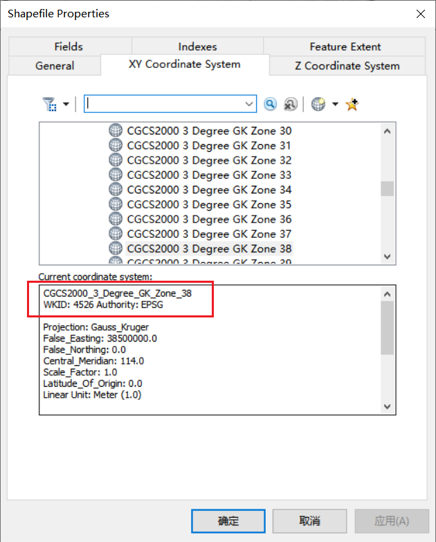
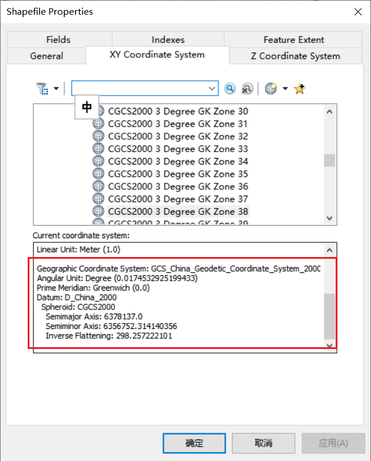
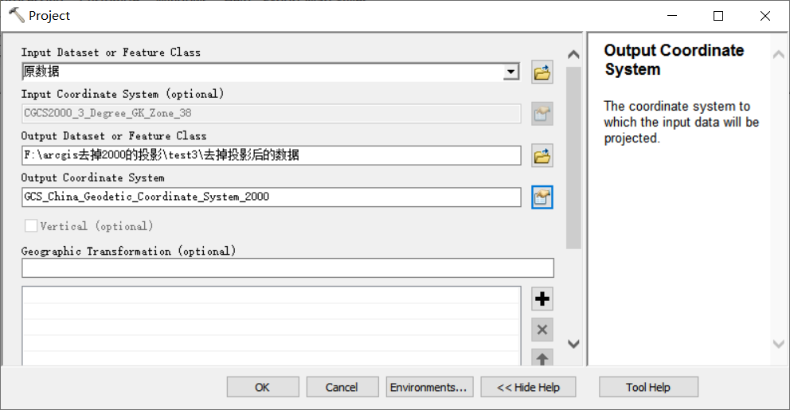
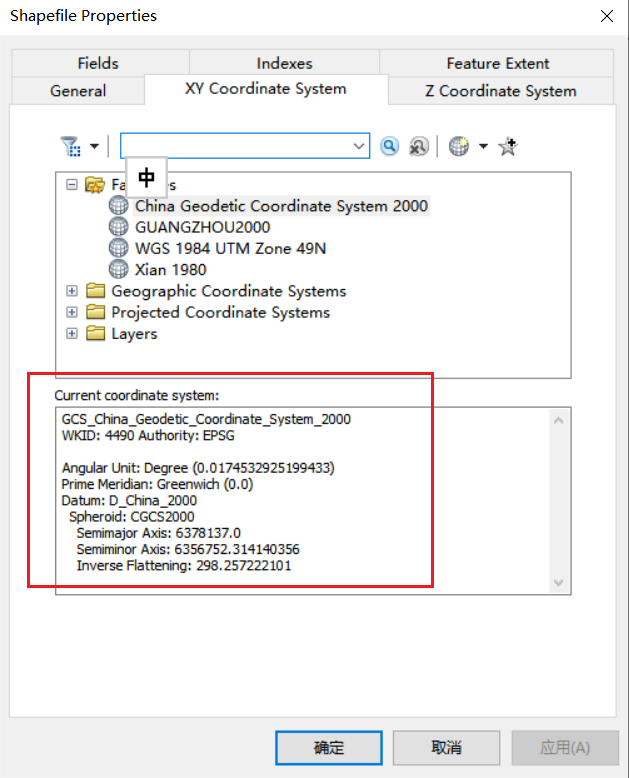
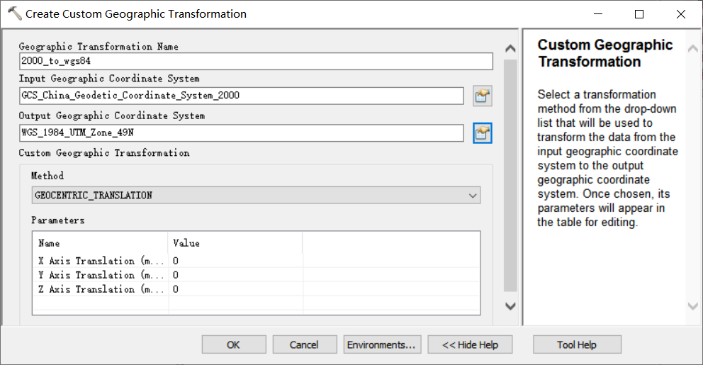
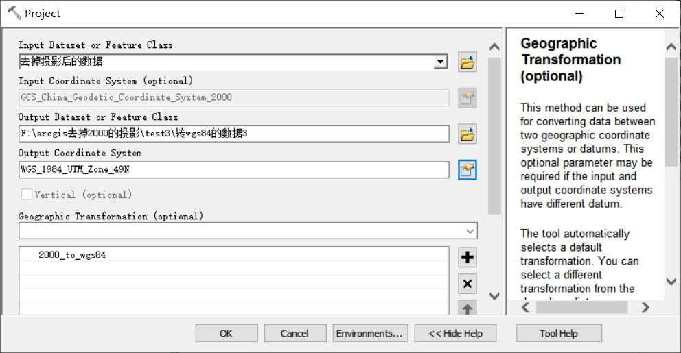
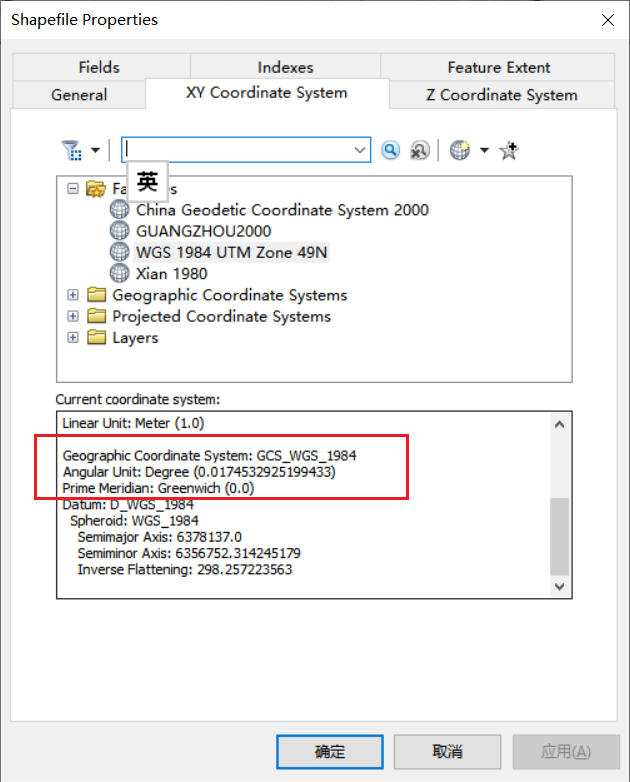

## 既有地理坐标系也有投影坐标系，去掉投影坐标系？  

ArcToolbox -> Data Management Tools -> Projections and Transformations -> Project

## 两个shp地理坐标系是相同的，但是命名不同？  

ArcToolbox -> Data Management Tools -> Projections and Transformations -> Define Projection 

## 地理坐标系转投影坐标系？  

[参考：Arcgis 地理坐标系转投影坐标系（WGS84转CGCS2000）](https://blog.csdn.net/qq_43542987/article/details/119933177)

需要有一个两个坐标系的变换（要么用arcmap自带的，要么自己创建一个）。  

ArcToolbox -> Data Management Tools -> Projections and Transformations -> Create Custom Geographic Transformation  

  

ArcToolbox -> Data Management Tools -> Projections and Transformations -> Define Projection  

   

   

---
