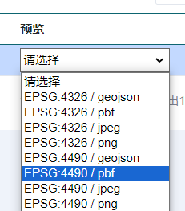

## 先拿urlTemplate?  


去geoserver的切片图层 点预览拿请求。  

  

```md 
http://192.168.2.114:9090/AgServer/gwc/service/wmts?REQUEST=GetTile&SERVICE=WMTS&VERSION=1.0.0&LAYER=hbduoguiheyi:aha_test222&STYLE=&TILEMATRIX=EPSG:4490:{level}&TILEMATRIXSET=EPSG:4490&FORMAT=application/vnd.mapbox-vector-tile&TILECOL={col}&TILEROW={row}

```


