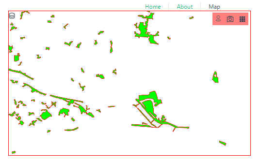
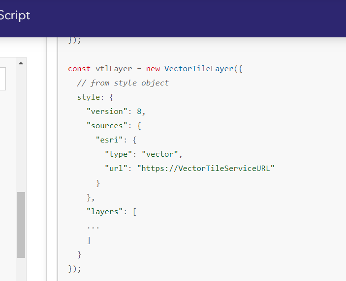
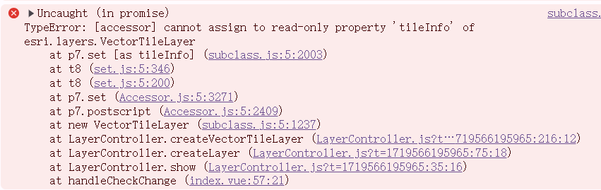
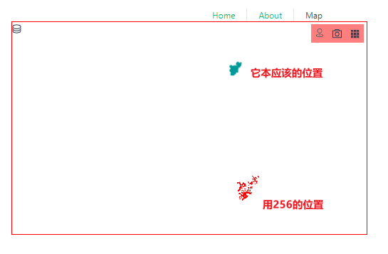
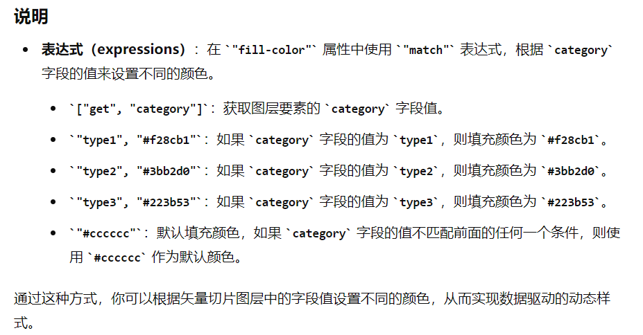
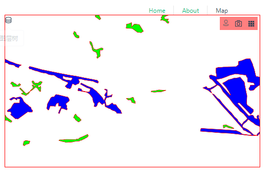

## 目的  

前端使用arcgis for js4 访问GeoServer发布的矢量切片服务。

## 1 arcgis for js4 加载它并在地图上展示   

### 全部代码  

```js title='使用VectorTileLayer.js'
import VectorTileLayer from "@arcgis/core/layers/VectorTileLayer.js";

const lconfig = {
  layerId:'2',
  name: '测试_geoserver_vectorTile',
  urlTemplate:'http://xxx.xxx.x.xxx:xxxx/geoServer/gwc/service/wmts/rest/命名空间:图层名test_abc/EPSG:4490/EPSG:4490:{z}/{y}/{x}?format=application/vnd.mapbox-vector-tile',
  // geoserver 上的图层名(不需要带命名空间)
  layerTable:'test_abc', 

}

const param = {
  id: lconfig.layerId,
  title:lconfig.name,
  style:{
    id:lconfig.id,
    version:8,
    sources:{
      abc:{
        type:'vector',
        'capabilities':'TileOnly',
        tiles:[
          lconfig.urlTemplate,
        ],
        // initialExtent: tileInfo4490Size512Meta.initialExtent, // 非必填
        // fullExtent: tileInfo4490Size512Meta.fullExtent,       // 非必填
        tileInfo:{
          ...tileInfo4490Size512, 
          // format:'pbf',
        }
      }

    },
    layers:[
      {
        id:lconfig.name+'a', //这个可以随便写
        source:'abc',
        'source-layer':lconfig.layerTable, //这个必须是geoserver上的图层名（不需要带命名空间） 
        // minzoom:0,  // 非必填  这个只是控制它的显示隐藏
        // maxzoom:24,  // 非必填  这个只是控制它的显示隐藏，还是会去请求18级的tile的，只是不会显示在地图上。
        type: "fill",
        paint: {
          "fill-color": "#00ff00",
          "fill-outline-color": "#ff0000",
        },
    
      }
    ]
  },
}
new VectorTileLayer(param)
```
[tileInfo4490Size512](/sourceCode/tileInfo/4490Size512.js)


### 效果  




## 十万个为什么???    


### 1. 阅读VectorTileLayer 文档 

网上写的五花八门的。   

[VectorTileLayer官方文档](https://developers.arcgis.com/javascript/latest/api-reference/esri-layers-VectorTileLayer.html#url)写的很好，不要一上来就去网上瞎搜！！！  

#### Overview

> Overview  
>> How the VectorTileLayer displays is defined by the [MapLibre style specification](https://maplibre.org/maplibre-style-spec/).  
>> VectorTileLayer style information is stored separately from its tiles.  
>> This means that one set of vector tiles may be styled in numerous ways without having to generate a new image cache for each style.  
>> This helps save space and speeds up the process of creating new map styles.   

👆矢量切片图层的样式和切片是分开保存的。（也就是切片不包括样式，你要自己写样式）  

#### Creating a VectorTileLayer

> Creating a VectorTileLayer
>> VectorTileLayers may be created in one of three ways: 
>> from a URL (either a service URL or a style URL),   
>> an ArcGIS portal item ID,   
>> or a JSON style object.  


#### style  

> style  
>> A style JSON object of vector tiles that will be used to render the layer.   
>> If initializing the layer with a style JSON object, the tiles are fetched from the tile servers specified in the style object.  


它还写了几个创建的例子,看起来from style object像是用的是第三方矢量切片服务。    

  


### 2. `a JSON style object` 应该怎么写?  

[参考1: MapLibre style specification](https://maplibre.org/maplibre-style-spec/)

[参考2: ArcGIS Vector Tile Style Editor](https://www.arcgis.com/apps/vtseditor/en/#/styles)  


```js title='简单.js'
const style = {
  // id:configData.id,
  version:8,
  sources:{
    abc:{
      type:'vector',
      tiles:[
        configData.urlTemplate,
      ],
      // initialExtent: tileInfo4490Size512Meta.initialExtent,
      // fullExtent: tileInfo4490Size512Meta.fullExtent,
      tileInfo:{
        ...tileInfo4490Size512,
        // format:'pbf',
      }
    }

  },
  layers:[
    {
      id:configData.name+'a', //Unique layer name
      type: "fill",
      paint: {
        "fill-color": "#00ff00",
        "fill-outline-color": "#ff0000",
      },
      'source-layer':configData.layerTable, //这个必须是geoserver上的图层名（不需要带命名空间）
      source:'abc', // 要和style>sources.abc对应：Name of a source description to be used for this layer. Required for all layer types except background.
      // minzoom:0,  // 这个只是控制它的显示隐藏
      // maxzoom:24,  // 这个只是控制它的显示隐藏，还是会去请求18级的tile的，只是不会显示在地图上。
    },
  ]
}

``` 


  


***里面有很多注意的点***  
怎么拿urlTemplate?  

tileInfo? 

minzoom,maxzoom,source-layer,source 都是啥?  


### 3. 怎么拿urlTemplate?  


#### 1 ~~去geoserver的切片图层 点预览拿请求~~。  

  

```md 
http://xxx.xxx.x.xxx:xxxx/geoServer/gwc/service/wmts?REQUEST=GetTile&SERVICE=WMTS&VERSION=1.0.0&LAYER=命名空间:图层名test_abc&STYLE=&TILEMATRIX=EPSG:4490:{level}&TILEMATRIXSET=EPSG:4490&FORMAT=application/vnd.mapbox-vector-tile&TILECOL={col}&TILEROW={row}

```

#### 2 去 wmts capabilities找   

```md
<ResourceURL format="application/vnd.mapbox-vector-tile" resourceType="tile" template="http://xxx.xxx.x.xxx:xxxx/geoServer/gwc/service/wmts/rest/命名空间:图层名test_abc/{style}/{TileMatrixSet}/{TileMatrix}/{TileRow}/{TileCol}?format=application/vnd.mapbox-vector-tile"/>

<!-- {style} -->
vector tile的样式要自己写，所以这里直接忽略它

{TileMatrixSet}

EPSG:4490

{TileMatrix}

EPSG:4490:0

{TileMatrix}/{TileRow}/{TileCol}

EPSG:4490:{z}/{y}/{x}


<!-- 最终： -->
http://xxx.xxx.x.xxx:xxxx/geoServer/gwc/service/wmts/rest/命名空间:图层名test_abc/EPSG:4490/EPSG:4490:{z}/{y}/{x}?format=application/vnd.mapbox-vector-tile

```

#### 3 总结

[参考：ArcGIS for JavaScript 加载 GeoServer 矢量切片服务](https://www.cnblogs.com/lqqgis/p/17965476)  

这个参考里用的urlTemplate是通过geoserver预览拿的，使用的时候会报错，无法解析`{z}`  
他认为是版本问题，且换了arcgis for4的版本有成功，有失败。  
我根据他的操作换了一个版本，还是无法加载成功。  

所以我用的 capabilities里找的url 很丝滑。  

### 4 tileInfo?   

#### 放的位置?  

我看了 style文档的style.sources中并没有tileInfo属性。  

我看 VectorTileLayer文档有tileInfo这个属性。  

我尝试把tileInfo拿出来，报错！  

```js 
new VectorTileLayer({
  id:'id',
  title:'title',
  tileInfo:{
    // ...
  },
  style:{
    // ...
  }
})

``` 

    

所以它还是老老实实放到style.sources里吧。  

#### 256还是512?   

[256](/sourceCode/tileInfo/4490.js)  
[512](/sourceCode/tileInfo/4490Size512.js)  

用256会导致位置偏移。  

  

#### 为什么一定要512?   

我全网搜索了....  

[参考：arcgis的create-vector-tile-index](https://pro.arcgis.com/en/pro-app/latest/tool-reference/data-management/create-vector-tile-index.htm)  
>Existing—The tiling scheme from an existing vector tile service will be used. Only tiling schemes with scales that double in progression through levels and have 512-by-512 tile size are supported. You must specify a vector tile service or tiling scheme file in the tiling_scheme parameter.  

[参考:What is the expected size of a single Mapbox Vector Tile in Pixels?](https://stackoverflow.com/questions/65443769/what-is-the-expected-size-of-a-single-mapbox-vector-tile-in-pixels)  

TODO  
[⭐参考：What is a root tile and how are they used to make a vector tile package with a local coordinate system?](https://support.esri.com/en-us/knowledge-base/faq-what-is-a-root-tile-and-how-are-they-used-to-make-a-000022396)  

👆还给你计算的公式.  
[World_Topo_Map (MapServer)](https://services.arcgisonline.com/ArcGIS/rest/services/World_Topo_Map/MapServer)


[参考：00252: Tiling scheme is not supported for vector tile layers](https://pro.arcgis.com/en/pro-app/latest/help/sharing/analyzer-error-messages/00252-tiling-scheme-is-not-supported-for-vector-tile-layers.html)  


### 5 style中的其它属性?  

#### minzoom,maxzoom  

非必填  

只是控制图层在底图上的显示隐藏。 
minzoom级以下不显示， maxzoom以上不显示。  
放大缩小地图的zoom，它还是会去请求某级的tile的，只是不会显示在地图上。  

#### 


### 6 调整它的样式?   

#### 根据图层的某个字段来设置不同的颜色?   

fill-color写成数组的样子。  

  

```js 
const style.layers = [
  {
    id:configData.name+'a', //这个可以随意写
    type: "fill",
    paint: {
      // "fill-color": "#00ff00",
      "fill-color":[
        "match",
        ["get", "DJ"],
        "小1型","#ff0000",
        "中型", "#00ff00",
        "大型", "#0000ff",
        "#cccccc" // 默认填充颜色

      ],
    },
    'source-layer':configData.layerTable, 
    source:'abc',
  }
]

```

   


## 参考  

[ArcGIS JS 4加载第三方矢量切片](https://juejin.cn/post/6844904015822602248)  
[Is it possible to add vector tile layer published by GeoServer layer using ArcGIS JS API？](https://gis.stackexchange.com/questions/300398/is-it-possible-to-add-vector-tile-layer-published-by-geoserver-layer-using-arcgi)


