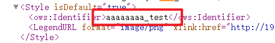
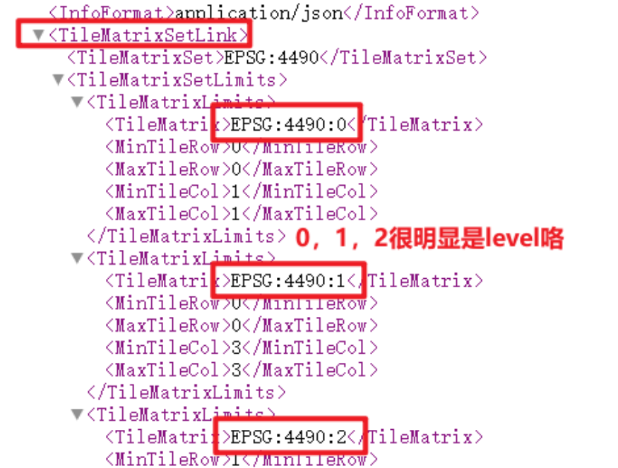
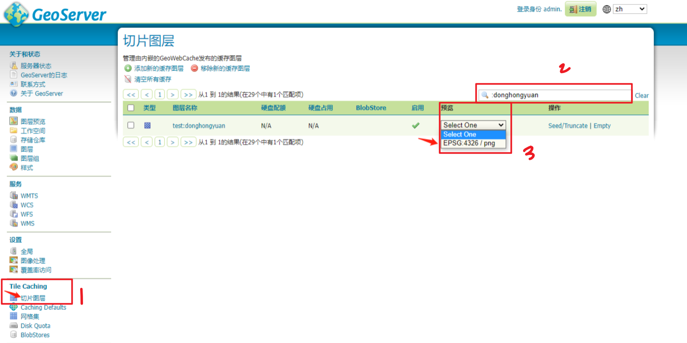
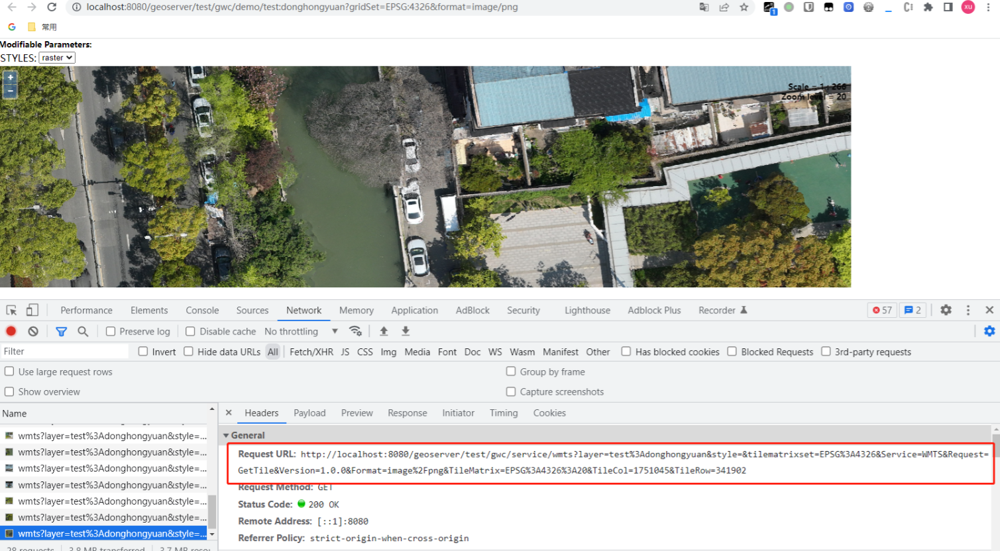
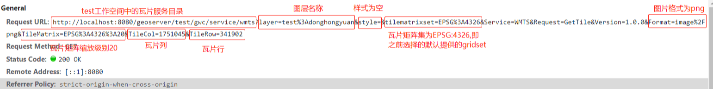
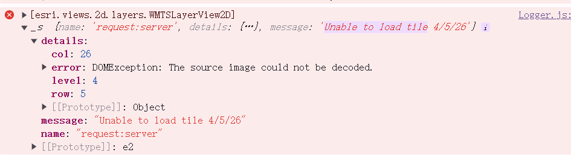
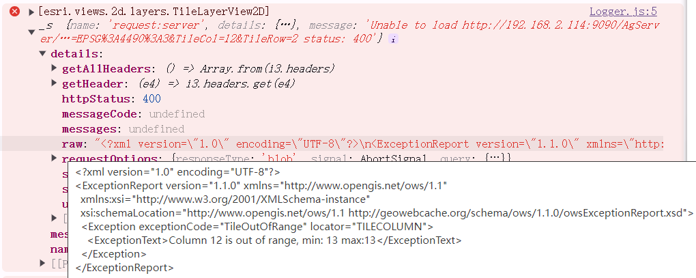

## 一、怎么确定我在geoserver上发布的服务是wmts呢?  

[geoserver发布图层服务](../geoserver/geoserver发布图层服务)


## 二、怎么找到请求地址,就像请求天地图地址那样?

[参考：ArcGIS API for JavaScript 4.x加载GeoServer发布的WMTS服务](https://www.cnblogs.com/youzi-xuchongyou/p/17337077.html)  


### 1 通过 wmts GetCapabilities  


```md
http://xxx.xxx.x.xxx:xxxx/geoServer/gwc/service/wmts?REQUEST=GetCapabilities
```
在浏览器中访问 WMTS 服务的 GetCapabilities URL，以验证配置是否正确。  
👆会展示所有的wmts图层服务。

搜索你想要的那个图层，比如aha  

  


```md 
http://xxx.xxx.x.xxx:xxxx/geoServer/gwc/service/wmts/rest/testt:aha_test222/{style}/{TileMatrixSet}/{TileMatrix}/{TileRow}/{TileCol}?format=image/png
```

- `{style}` 去哪里找呢? 

  

```md 
http://xxx.xxx.x.xxx:xxxx/geoServer/gwc/service/wmts/rest/testt:aha_test222/{style}/{TileMatrixSet}/{TileMatrix}/{TileRow}/{TileCol}?format=image/png

{style} 就替换为aaaaaaa_test
```

- `{TileMatrixSet}` 去哪里找呢? 
tilematrixset

  

```md 
http://xxx.xxx.x.xxx:xxxx/geoServer/gwc/service/wmts/rest/testt:aha_test222/aaaaaaa_test/{TileMatrixSet}/{TileMatrix}/{TileRow}/{TileCol}?format=image/png

{TileMatrixSet} 就替换为 EPSG:4490
{TileMatrix} 替换为 EPSG:4490:{TileMatrix}
```

最后得到：

```md 
http://xxx.xxx.x.xxx:xxxx/geoServer/gwc/service/wmts/rest/testt:aha_test222/aaaaaaa_test/EPSG:4490/EPSG:4490:{TileMatrix}/{TileRow}/{TileCol}?format=image/png

```

你可以写一个TileMatrix、row、col，然后在浏览器上看一眼。


### 2 (推荐) 通过瓦片图层预览  

1. 在geoserver -> 瓦片图层 中预览发布的图层  


  

2. 打开 控制台 看它的请求   

  

3. 打开 控制台 看它的请求   

  

4. 最后得到：

```md 
http://xxx.xxx.x.xxx:xxxx/geoServer/gwc/service/wmts/rest/testt:aha_test222/aaaaaaa_test/EPSG:4490/EPSG:4490:{TileMatrix}/{TileRow}/{TileCol}?format=image/png


http://xxx.xxx.x.xxx:xxxx/geoServer/gwc/service/wmts?layer=图层空间%3A图层名&style=&tilematrixset=EPSG%3A4490&Service=WMTS&Request=GetTile&Version=1.0.0&Format=image%2Fpng&TileMatrix=EPSG%3A4490%3A{TileMatrix}&TileCol={TileCol}&TileRow={TileRow}

// %3A 是冒号。

```


### 总结  

两种方式最终得到的urlTemplate都可以用。


## 三、arcgis js4 怎么加载 geoserver wmts?  

用WMTSLayer还是WebTileLayer  

### ~~用WMTSLayer~~  

```js title='使用WMTSLayer.js'
import WMTSLayer from "@arcgis/core/layers/WMTSLayer.js";
new WMTSLayer({
    // url: "https://gibs.earthdata.nasa.gov/wmts/epsg4326/best", // url to the service
    url: 'http://xxx.xxx.x.xxx:xxxx/geoServer/gwc/service/wmts',

    activeLayer: {
    // id: "SRTM_Color_Index",
    id: '图层空间:图层名',
    }
});
```


  

无解。

看请求是200，但是arcgis解析不了它。  


### 用WebTileLayer  


```js title='使用WebTileLayer.js'
import WebTileLayer from "@arcgis/core/layers/WebTileLayer.js";

const configData =   {
    id:'3',
    name:'geoserver_wmts_WebTileLayer',
    type: "wmts",
    // urlTemplate: "http://xxx.xxx.x.xxx:xxxx/geoServer/gwc/service/wmts/rest/testt:aha/{style}/{TileMatrixSet}/{TileMatrix}/{TileRow}/{TileCol}?format=image/png",
    // urlTemplate: "http://xxx.xxx.x.xxx:xxxx/geoServer/gwc/service/wmts/rest/testt%3Aaha/testt%3Aahastyle/EPSG%3A4490/EPSG%3A4490%3A{level}/{row}/{col}?format=image/png",
    urlTemplate: "http://xxx.xxx.x.xxx:xxxx/geoServer/gwc/service/wmts?layer=testt%3Aaha&style=&tilematrixset=EPSG%3A4490&Service=WMTS&Request=GetTile&Version=1.0.0&Format=image%2Fpng&TileMatrix=EPSG%3A4490%3A{level}&TileCol={col}&TileRow={row}",
    layerTable:'aha',
    layerType: "geoserverWMTS_WebTileLayer"      
}
new WebTileLayer({
    id: configData.id,
    urlTemplate: configData.urlTemplate,
    tileInfo: tileInfo4490,
    spatialReference: this.view.spatialReference,
    title: configData.name,
});
```


#### tileOutOfRange报错  

  

1. 出现的原因1:查看范围超出影像数据的范围?  

如果是因为查看范围超出了影像数据的范围，这种报错，好像无所谓。

你去查看影像所在的范围，还是能查看到影像的。  

2. 出现的原因2: geoserver的gridset和WebTileLayer的tileInfo没对上  

我测试了geoserver的gridset用4490 ，WebTileLayer的tileInfo用天地图的就会报这个错误。  

所以解决方法就是让两者一致咯。  


## WebTileLayer.tileInfo.lods 从哪里拿?     


### 4490的lods  

如果是geoserver发布的wmts切片需要用到WebTileLayer -> tileInfo -> lods ,  

则直接去geoserver的 gridset copy 对应的过来就行了。

```js 'title=4490.js'
export const initialExtent = {
    xmin: -180,
    ymin: -90,
    xmax: 180,
    ymax: 90,
    spatialReference: {
        wkid: 4490,
    }
};

export const fullExtent = {
    xmin: -180,
    ymin: -90,
    xmax: 180,
    ymax: 90,
    spatialReference: {
        wkid: 4490,
    }
};

export const lods = [
    {
        level: 1,
        resolution: 0.3515625,
        scale: 139770566.00717944
    },
    {
        level: 2,
        resolution: 0.17578125,
        scale: 69885283.00358972
    },
    {
        level: 3,
        resolution: 0.087890625,
        scale: 34942641.50179486
    },
    {
        level: 4,
        resolution: 0.0439453125,
        scale: 17471320.75089743
    },
    {
        level: 5,
        resolution: 0.02197265625,
        scale: 8735660.375448715
    },
    {
        level: 6,
        resolution: 0.010986328125,
        scale: 4367830.1877243575
    },
    {
        level: 7,
        resolution: 0.0054931640625,
        scale: 2183915.0938621787
    },
    {
        level: 8,
        resolution: 0.00274658203125,
        scale: 1091957.5469310894
    },
    {
        level: 9,
        resolution: 0.001373291015625,
        scale: 545978.7734655447
    },
    {
        level: 10,
        resolution: 0.0006866455078125,
        scale: 272989.38673277234
    },
    {
        level: 11,
        resolution: 0.0003433227539062,
        scale: 136494.69336636632
    },
    {
        level: 12,
        resolution: 0.0001716613769531,
        scale: 68247.34668318316
    },
    {
        level: 13,
        resolution: 0.0000858306884766,
        scale: 34123.67334161145
    },
    {
        level: 14,
        resolution: 0.0000429153442383,
        scale: 17061.836670805726
    },
    {
        level: 15,
        resolution: 0.0000214576721191,
        scale: 8530.918335382985
    },
    {
        level: 16,
        resolution: 0.0000107288360596,
        scale: 4265.45916771137
    },
    // {
    //     level: 17,
    //     resolution: 0.0000053644180298,
    //     scale: 2132.729583855685
    // },
    // {
    //     level: 18,
    //     resolution: 0.0000026822090149,
    //     scale: 1066.3647919278426
    // },
    // {
    //     level: 19,
    //     resolution: 0.0000013411045074,
    //     scale: 533.1823959440429
    // },
    // {
    //     level: 20,
    //     resolution: 0.0000006705522537,
    //     scale: 266.59119797202146
    // },
    // {
    //     level: 21,
    //     resolution: 0.0000003352761269,
    //     scale: 133.2955990058892
    // },
    // {
    //     level: 22,
    //     resolution: 0.0000001676380634,
    //     scale: 66.64779948306612
    // },
    // {
    //     level: 23,
    //     resolution: 0.0000000838190317,
    //     scale: 33.32389974153306
    // },
    // {
    //     level: 24,
    //     resolution: 0.0000000419095159,
    //     scale: 16.66194989064501
    // },
];

export default {
    dpi: 96,
    rows: 256,
    cols: 256,
    compressionQuality: 0,
    origin: {
        x: -180,
        y: 90,
    },
    spatialReference: {
        wkid: 4490
    },
    lods,
};

```


## 参考  
[ArcGIS API for JavaScript 4.x加载GeoServer发布的WMTS服务](https://www.cnblogs.com/youzi-xuchongyou/p/17337077.html)
[geoserver发布wmts服务并使用arcgis js4.x调用](https://blog.csdn.net/FlyToTheWorld/article/details/125906392)

[天地图官方文档](http://lbs.tianditu.gov.cn/server/MapService.html)


