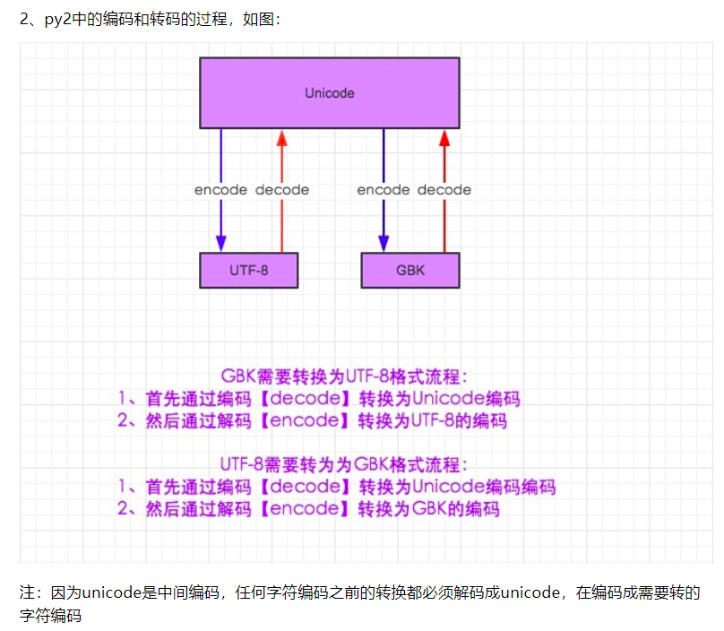

ArcGIS默认使用unicode编码.  

unicode:Unicode是一种字符编码标准，它为每一个字符和符号定义了唯一的数字（代码点），以支持全球所有主要语言。  

encode: 编码是指将Unicode字符串转换成特定编码格式的字节序列的过程。常见的编码格式包括UTF-8、UTF-16、ASCII和GBK等。  

decode: 解码是指将特定编码格式的字节序列转换回Unicode字符串的过程。  


```py 
# -*- coding: cp936 -*-
aa = u'哈哈'   # 表示aa已经是unicode编码。  
bb = '哈哈'    # 表示bb是cp936编码。  

# unicode(bb, 'cp936') 和 bb.decode('cp936') 是等效的

# 只要记住  因为unicode是中间编码，任何字符编码之前的转换都必须解码成unicode，在编码成需要转的字符编码  


```



### 参考

[参考：python2.x字符编码转码](https://www.cnblogs.com/QZrun220/p/13295041.html)  


---
