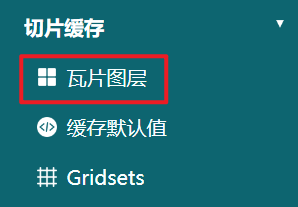
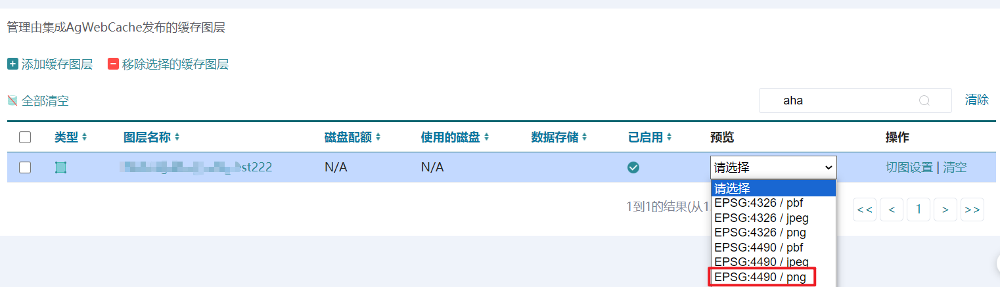
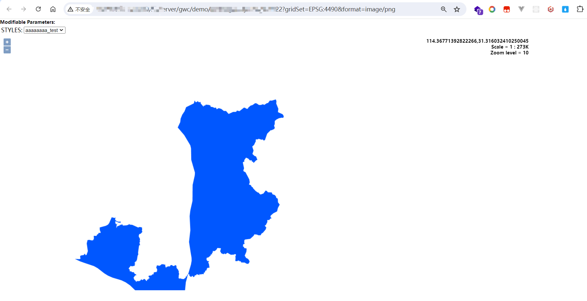
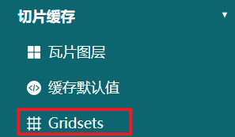

## 通过qgis导入到postgresql中的所有图层，在geoserver上面发布成对应的服务。怎样能批量发布?


:::tip 知识点

### 1. geoserver可以对同一数据源进行多次发布  

### 2. geoServer的REST API提供了获取所有样式的接口

get 请求 `{geoserver_url}/rest/workspaces/{workspace}/styles.json`


:::

### 思路  

编写脚本使用GeoServer REST API   

1. 调接口发布图层  
2. 图层设置样式（如果有）  

### 代码
```py 
import requests
import json

# GeoServer的URL和认证信息

geoserver_url = "http://xxx.xxx.x.xxx:xxxx/geoServer"
username = "admin"
password = "xxx"

# 数据存储配置
workspace = "workspace"
datastore = "datastore"
db_params = {
    "host": "xxx.xxx.x.xxx",
    "port": "xxxx",
    "database": "数据库名",
    "user": "postgresql用户名",
    "passwd": "postgresql密码",
    "dbtype": "postgis"
}

# 图层列表
layers = [ # 替换为你实际的图层名
    {
        'db_name':'xxx', # 数据库表名
        'name':'aaa', # 发布到geoserver的图层名
        'abstract':'这个图层是干嘛的', # 图层摘要
        'style_name':'aa_bb_cc' # 模糊的geoserver样式名 （这里懒得写完整的样式名，后面写方法来匹配了）
    },

]


# 获取所有样式名：需要判断geoserver中有没有我写的样式名，如果有则给图层加上，没有就不加样式了
def get_all_styles():
    styles_url = f"{geoserver_url}/rest/workspaces/{workspace}/styles.json"
    response = requests.get(styles_url, auth=(username, password))
    if response.status_code in [200, 201]:
        styles = response.json()["styles"]["style"]
        style_names = [style["name"] for style in styles]
        return style_names
    else:
        print(f"Failed to get styles: {response.text}")
        return []

# 为了模糊查找geoserver样式名: 
# 模糊样式名aa_bb_dd_ee, geoserver的样式名可能是aa_bb_cc_dd_ee，我需要拿模糊名去找对应的geoserver中的样式名    
def split_by_second_underscore(s):
    # 查找第一个和第二个下划线的位置
    first_underscore = s.find('_')
    if first_underscore == -1:
        return s, ''  # 没有下划线
    second_underscore = s.find('_', first_underscore + 1)
    if second_underscore == -1:
        return s, ''  # 只有一个下划线
    # 分割字符串
    return s[:second_underscore], s[second_underscore + 1:]

def split_string(s):
    # 查找第一个、第二个和第三个下划线的位置
    first_underscore = s.find('_')
    if first_underscore == -1:
        return s, ''  # 没有下划线
    second_underscore = s.find('_', first_underscore + 1)
    if second_underscore == -1:
        return s, ''  # 只有一个下划线
    third_underscore = s.find('_', second_underscore + 1)
    if third_underscore == -1:
        return s, ''  # 只有两个下划线

    # 根据下划线位置分割字符串
    part1 = s[:second_underscore]
    part2 = s[third_underscore + 1:]

    return part1, part2

# 模糊查找样式名
def find_matching_style(partial_name, style_names):
    partial_prefix, partial_suffix = split_by_second_underscore(partial_name)
    for style_name in style_names:
        tmp_prefix, tmp_suffix = split_string(style_name)
        if partial_prefix ==  tmp_prefix and partial_suffix == tmp_suffix:
            return style_name
    return None

# 获取所有样式名
style_names = get_all_styles()

# 发布图层
def publish_layer(layerInfo):
    layer_name = layerInfo["name"]
    db_name = layerInfo["db_name"]
    abstract = layerInfo["abstract"]
    style_name = layerInfo['style_name']
    layer_url = f"{geoserver_url}/rest/workspaces/{workspace}/datastores/{datastore}/featuretypes"
    headers = {"Content-Type": "application/json"}
    payload = {
        "featureType": {
            "name": layer_name,
            "nativeName": db_name,
            "title": layer_name,
            "abstract": abstract,
        }
    }
    response = requests.post(layer_url, auth=(username, password), headers=headers, json=payload)
    if response.status_code in [200, 201]:
        print(f"Layer {layer_name} published successfully")
    else:
        print(f"Failed to publish layer {layer_name}: {response.text}")

    # 找到匹配的样式名
    matching_style = find_matching_style(style_name, style_names)
    # 设置图层样式
    if matching_style:
      style_url = f"{geoserver_url}/rest/layers/{workspace}:{layer_name}"
      payload = {
          "layer": {
              "defaultStyle": {
                  "name": matching_style,
                  "workspace": workspace
              }
          }
      }
      response = requests.put(style_url, auth=(username, password), headers=headers, json=payload)
      if response.status_code in [200, 201]:
          print(f"Style {matching_style} applied to layer {layer_name} successfully")
      else:
          print(f"Failed to apply style {matching_style} to layer {layer_name}: {response.text}")


# 批量发布图层
for layerInfo in layers:
    publish_layer(layerInfo)
```


---


## geoserver 发布wmts服务?  

按照正常流程发布一个图层后。  

在左侧栏的`瓦片图层`下可以找到该图层。  
  

你可以预览一下  
  

  

***注意：此时看到的瓦片服务是geowebcache动态生成的。***  
就这样用就行。不需要切图到本地。

### 给图层添加切片方案 gridsets  

geoserver -> 图层 -> 编辑图层 -> 切片缓存中，可以为该图层设置切片方案gridsets 

### 设置切片方案  

  

在这里可以创建一个新的gridset。（比如4490）  


[参考：](https://blog.csdn.net/qq_45956730/article/details/129792761)