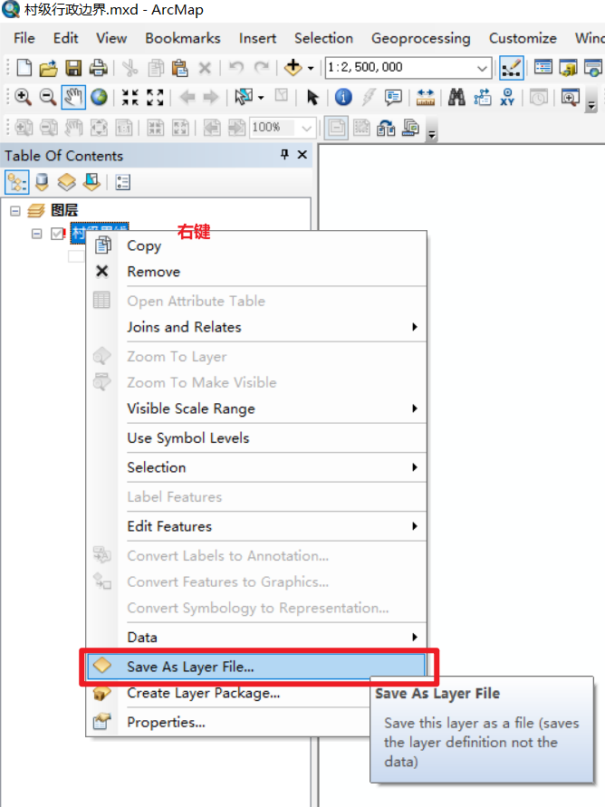
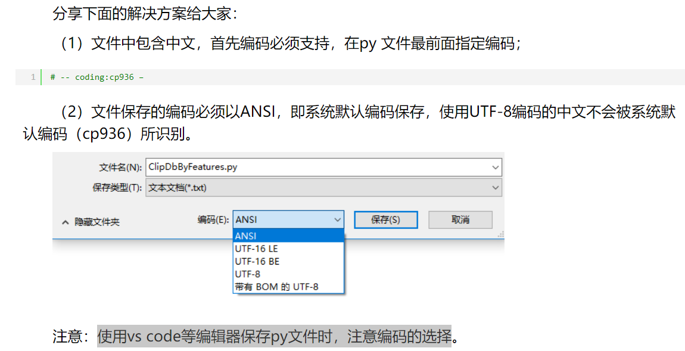
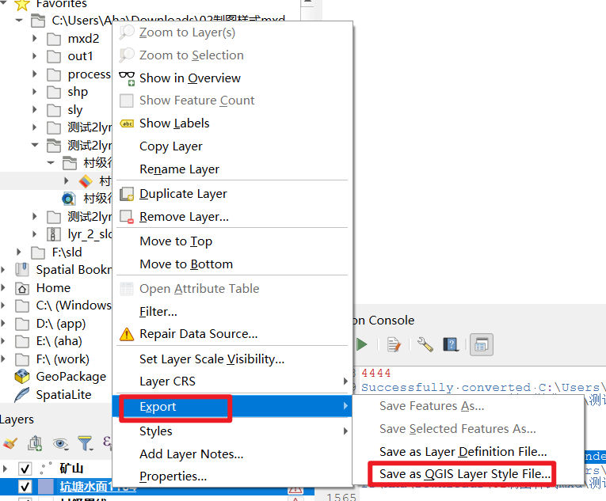
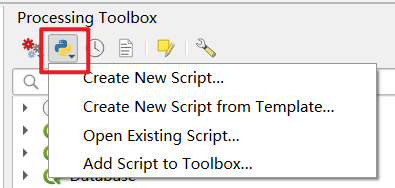
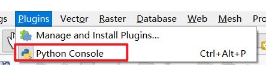
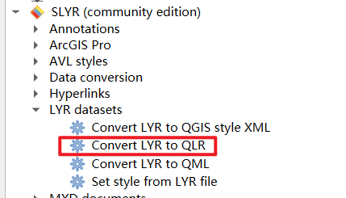
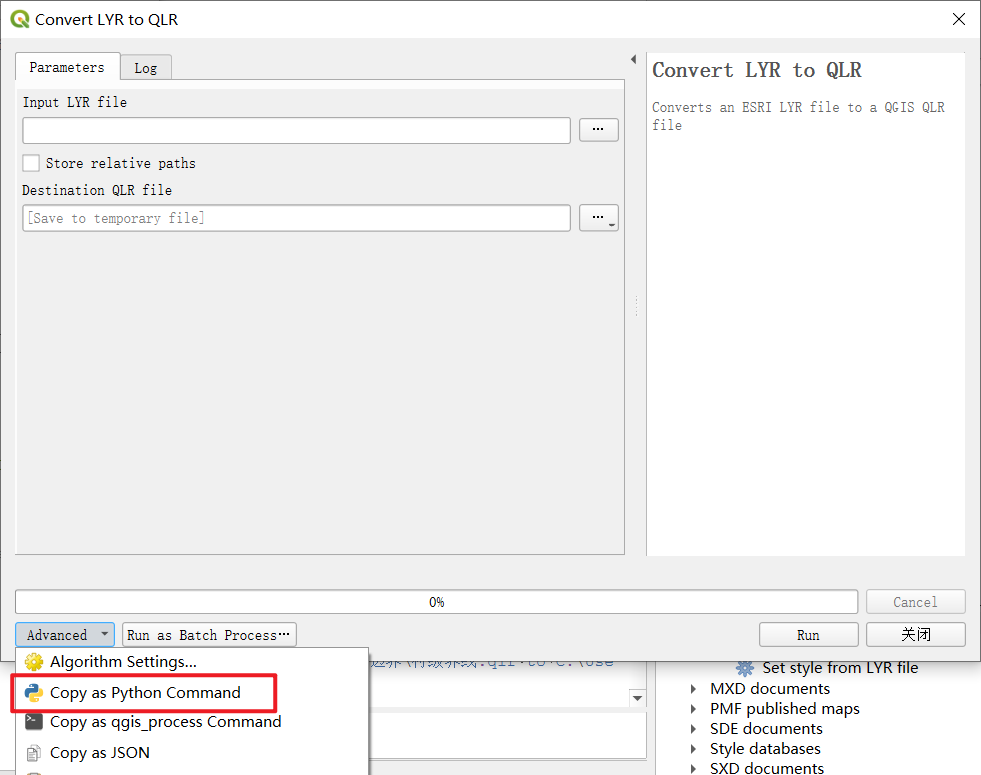
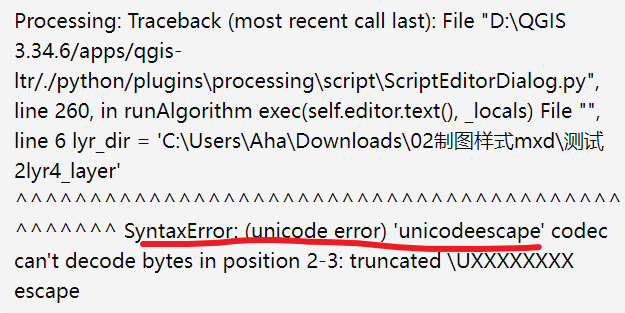

## 需求  

给了一堆没有数据源的mxd文件，想要它的sld样式文件。

## 思路  

### 思路0：  


.lyr -> qgis slyr(community) export .sld的问题：  能用python批量操作吗？  

在python中使用qgis api？  

无法解析导入“qgis.core”，在VSCode中配置QGIS Python解释器？   


### 思路1：.mxd -> esri .style  -> qgis slyr2.0 -> .xml -> .sld  

本来的思路是这样。

但是生成的xml还需要我写代码转为sld。

后来偶然发现qgis里可以直接保存样式为sld。


### 思路2：.mxd  ->  .lyr -> qgis slyr(community) -> .qlr -> export .sld  

1. mxd转为.lyr  
2. 在qgis中展示.lyr文件 (qgis不支持需要安装slyr后自动支持了)  
3. ~~pyqgis 将 lyr 导出为 sld~~  
3. pyqgis 将lyr 转为 qlr (slyr支持)  
4. pyqgis 将qlr 转为 sld  

误打误撞  


## 手动操作 .mxd  ->  .lyr  


手动操作很简单...  

  


## 批量操作 .mxd  ->  .lyr  

因为我有很多mxd文件，所以需要批量操作。  

### 思路  

用arcpy.   

打开mxd文件，遍历里面的图层，保存图层为lyr文件，关闭mxd文件。  


### 实现  
1. 遍历文件夹中的mxd文件  
2. 打开mxd文件，遍历里面的图层，保存图层为lyr文件（如果市图层组则继续遍历图层组）。  
3. 在mxd文件目录下创建同名文件夹，生成的lyr文件就存到这里（如果mxd里的图层是个组，我会继续创建文件夹来保存组）。    


### 代码
```py 
# -*- coding: cp936 -*-

import arcpy
import os

top_directory = r"C:\测试mxd2lyr"

def save_layers_from_mxd(mxd_name,mxd_path, output_dir):

    # 创建mxd同名的文件夹
    new_output_dir = os.path.join(output_dir, mxd_name)
    if not os.path.exists(new_output_dir):
        os.makedirs(new_output_dir)

    try:
        mxd = arcpy.mapping.MapDocument(mxd_path)
        layers = arcpy.mapping.ListLayers(mxd)

        for layer in layers:
            aa = isinstance(layer, arcpy.mapping.Layer)
            print(aa)
            bb= layer.supports("DATASOURCE") #图层是否有数据源
            print(bb)
            # layer.save()
            
            if layer.isGroupLayer:
                print('isGroupLayer--------------')
              
                sublayers = layer

                # 创建当前图层同名的文件夹
                new_output_dir2 = os.path.join(new_output_dir, layer.name)
                if not os.path.exists(new_output_dir2):
                    os.makedirs(new_output_dir2)

                for sublayer in sublayers:
                    name = sublayer.name
                    new_output_layer2 = os.path.join(new_output_dir2, name + ".lyr")
                    sublayer.saveACopy(new_output_layer2)
            else:
                name = layer.name
                print('layer---------------')
                new_output_layer = os.path.join(new_output_dir, name + ".lyr")

                #arcpy.SaveToLayerFile_management(layer, output_layer)
                layer.saveACopy(new_output_layer)
        del mxd
    except Exception as e:
        print("Error processing")
        print(e)
def traverse_and_process(directory):
    print(directory)
    for root, dirs, files in os.walk(directory):
        for file in files:
            if file.endswith(".mxd"):
                
                print('-----------我进来了---------')
                mxd_path = os.path.join(root, file)
                output_dir = root
                mxd_path = unicode(mxd_path,'cp936')
                mxd_name, _ = os.path.splitext(file)
                mxd_name = unicode(mxd_name,'cp936')
                output_dir = unicode(output_dir,'cp936')
                
                save_layers_from_mxd(mxd_name,mxd_path, output_dir)

print('---------traverse_and_process-------------')
traverse_and_process(top_directory)

```


### 出现的问题 

:::danger

#### 1 使用vscode写代码遇到中文会乱码 ?   

我一开始在vscode中写代码，用的python环境是arcmap带的python2.x。但是运行后会报错，因为中文路径会乱码。  

解决：  


[参考：使用vs code等编辑器保存py文件时，注意编码的选择](https://www.cnblogs.com/liweis/p/13069311.html)

可以运行，但是保存后的文件在vscode里打开中文全显示乱码，所以我放弃了。 

我直接在arcmap带的 **IDLE(Python GUI)**中写代码咯。

#### 2 使用arcmap自带的idle写代码遇到中文的处理 ?  

[参考：arcpy中python2.x编码问题](https://nullaha.github.io/docs/gis/arcpy中python2.x编码问题)


#### 3 mxd中的图层没有data source无法使用arccpy.saveToLayerFile_management Failed to execute (SaveToLayerFile) ?  

mxd中的图层没有data source,会报Failed to execute. Parameters are not valid.ERROR 000840: The value is not a Layer.Failed to execute (SaveToLayerFile).错误。

我为什么老抓这saveToLayerFile_management这个方法不放呢，我看了arcpy的layer类文档后，发现可以直接用layer.save()来保存lyr呀。

判断图层是否有数据源：  
```py
layer.supports("DATASOURCE")
layer.dataSource
```

参考：

[判断图层是否有数据源](https://support.esri.com/zh-cn/knowledge-base/use-python-to-list-the-data-sources-of-all-layers-in-th-000011530)  

[arcpy的layer类](https://desktop.arcgis.com/zh-cn/arcmap/latest/analyze/arcpy-mapping/layer-class.html)  

[Save Layer File with Python](https://community.esri.com/t5/python-questions/save-layer-file-with-python/td-p/298685)  

[How to save all layers in a MXD with arcpy](https://gis.stackexchange.com/questions/78082/how-to-save-all-layers-in-a-mxd-with-arcpy)  


:::


## qgis中展示 .lyr  

### 思路  

qgis不支持/不识别esri的lyr文件  

安装slyr插件  

使用slyr插件在qgis中打开lyr文件

### 1 安装slyr插件  

直接qgis插件中搜索 `SLYR (Community Edition)` 安装就行。  

安装后需要在 Processing Toolbox -> options -> SLYR  中处理mdbtools 和inkscape。 
[参考：SLYR  中处理mdbtools 和inkscape](https://nullaha.github.io/docs/gis/%E4%BD%BF%E7%94%A8qgis%E5%B0%86esri%20style%E8%BD%AC%E4%B8%BAxml) 


### 出现的问题 
:::danger

#### 1 `SLYR (Community Edition)`安装后工具箱处不显示 ?   

重新启动qgis

:::


## 手动操作 .lyr -> .sld  



## 批量操作 .lyr -> .qlr -> .sld 

### 在哪写代码?  

本来打算用vscode写，在网上搜了好几圈怎么配环境都不行。  

再加上涉及到要配环境变量，我电脑里本来就有一个版本的python了，再配一个版本的py变量会有问题。  

所以我放弃了。

直接在gqis里写。  




这样就可以写代码，然后在python console中看运行后的打印、报错信息了。

### ~~将lyr文件转为sld文件~~  

我试了，反正我不行。  

我认为本质上还是qgis不支持lyr。

需要借助slyr插件才行。


### 将lyr文件转为qlr文件  

那就多做一步，借助slyr将所有的lyr转为qlr。  

在python scrpit中怎么使用这个插件呢?  


  

粘贴板上会存这个命令的py代码，照葫芦画瓢写就行。

```py 
# 这是copy as py command 给我的：
# processing.run("slyr:lyrtoqlr", {'INPUT':'C:\\Users\\Aha\\Downloads\\村级界线.lyr','USE_RELATIVE_PATHS':False,'OUTPUT':'TEMPORARY_OUTPUT'})

# 将lyr转为qlr
def convert_lyr_to_qlr(lyr_path):
    qlr_path = os.path.splitext(lyr_path)[0] + ".qlr"
    processing.run("slyr:lyrtoqlr", {'INPUT': lyr_path, 'USE_RELATIVE_PATHS': False, 'OUTPUT': qlr_path})
    print(f"Converted {lyr_path} to {qlr_path}")

# 批量处理
def run_lyr_to_qlr(lyr_dir):
    for root, dirs, files in os.walk(lyr_dir):
        for file_name in files:
            if file_name.endswith(".lyr"):
                lyr_path = os.path.join(root, file_name)
                convert_lyr_to_qlr(lyr_path)
```


### 将qlr文件转为sld文件  

```py 
def convert_qlr_to_sld(qlr_path):
    project = QgsProject.instance()
    QgsLayerDefinition.loadLayerDefinition(qlr_path, project, project.layerTreeRoot())
    layers = project.mapLayers().values()
    layer = list(layers)[-1]  # 拿图层面板中的最后一个图层咯

    #if not layer.isValid(): # 如果没有数据源这里会返回true，所以我注释掉了。
        #print(f"Failed to load {qlr_path}")
        #return

    # 生成输出文件路径（和qlr同名同目录咯）
    sld_path = os.path.splitext(qlr_path)[0] + ".sld"
    
    # 保存为 SLD 文件
    success = layer.saveSldStyle(sld_path)
    if success:
        print(f"Successfully converted {qlr_path} to {sld_path}")
    else:
        print(f"Failed to save {sld_path}")

    # 从QGIS项目中移除图层
    project.removeMapLayer(layer.id())
```


### 出现的问题 
:::danger

#### 1 SyntaxError: (unicode error) 'unicodeescape' codec ?  

  

使用原始字符串（在字符串前加 r）或者将反斜杠替换为双反斜杠。  
aa = r''   


#### 2 processing script editor  Seems there is no valid script in the file ?   
点运行代码后，代码执行了，但是会弹窗提示。  

没关系，只要不是console里有报错信息都不影响代码的运行的。  

（它只是提醒你运行的这段代码不是一个有效的processing script而已）

[](https://gis.stackexchange.com/questions/467817/simple-script-is-working-in-python-console-but-gets-error-in-script-editor-pyqg)


#### 3 qlr太多，运行代码后，qgis可能会卡住 ?  

不要动，代码在执行呢。一会就好了。  


:::

## 参考：  
[Convert ArcGIS layer files (.lyr) to QGIS styles (.qml)](https://www.burdgis.com/blog/view/convert-arcgis-layer-files-lyr-to-qgis-styles-qml/)  
[slyr文档](https://north-road.com/slyr/)  
[qgis脚本--批量导出sld](https://blog.csdn.net/bamboo_2001/article/details/129544529)  

[Loading QLR file in QGIS using PyQGIS](https://gis.stackexchange.com/questions/432664/loading-qlr-file-in-qgis-using-pyqgis)  


## 最终代码  
```py 
import os
from qgis.core import QgsProject,QgsVectorLayer,QgsLayerTreeLayer,QgsApplication,QgsLayerDefinition,QgsRuleBasedRenderer
from qgis.gui import QgsLayerTreeView
from qgis.analysis import QgsNativeAlgorithms
import processing
print(1)

#设置.lyr folder
lyr_dir = r'C:\Users\Downloads\测试lyr'

# 注册处理插件
QgsApplication.processingRegistry().addProvider(QgsNativeAlgorithms())


def convert_lyr_to_qlr(lyr_path):
    qlr_path = os.path.splitext(lyr_path)[0] + ".qlr"
    processing.run("slyr:lyrtoqlr", {'INPUT': lyr_path, 'USE_RELATIVE_PATHS': False, 'OUTPUT': qlr_path})
    print(f"Converted {lyr_path} to {qlr_path}")

def convert_qlr_to_sld(qlr_path):
    project = QgsProject.instance()
    QgsLayerDefinition.loadLayerDefinition(qlr_path, project, project.layerTreeRoot())
    layers = QgsProject.instance().mapLayers().values()
    layer = list(layers)[-1]
    print('aaaabb')

    #if not layer.isValid():
        #print(f"Failed to load {qlr_path}")
        #return
    #for renderer in layer.renderer().symbol().symbolLayers():

    # todo:修改渲染器规则的名称

    # 生成输出文件路径
    sld_path = os.path.splitext(qlr_path)[0] + ".sld"
    
    # 保存为 SLD 文件
    success = layer.saveSldStyle(sld_path)
    if success:
        print(f"Successfully converted {qlr_path} to {sld_path}")
    else:
        print(f"Failed to save {sld_path}")

    # 从QGIS项目中移除图层
    QgsProject.instance().removeMapLayer(layer.id())

                

# 第一步：将所有 .lyr 文件转换为 .qlr 文件
def run_lyr_to_qlr(lyr_dir):
    for root, dirs, files in os.walk(lyr_dir):
        for file_name in files:
            if file_name.endswith(".lyr"):
                lyr_path = os.path.join(root, file_name)
                convert_lyr_to_qlr(lyr_path)


# 第二步：将所有 .qlr 文件转换为 .sld 文件
def run_batch_qlr(lyr_dir):
    for root, dirs, files in os.walk(lyr_dir):
        for file_name in files:
            if file_name.endswith(".qlr"):
                qlr_path = os.path.join(root, file_name)
                convert_qlr_to_sld(qlr_path)
       

# 执行       
#run_lyr_to_qlr(lyr_dir)
run_batch_qlr(lyr_dir)


```


---


