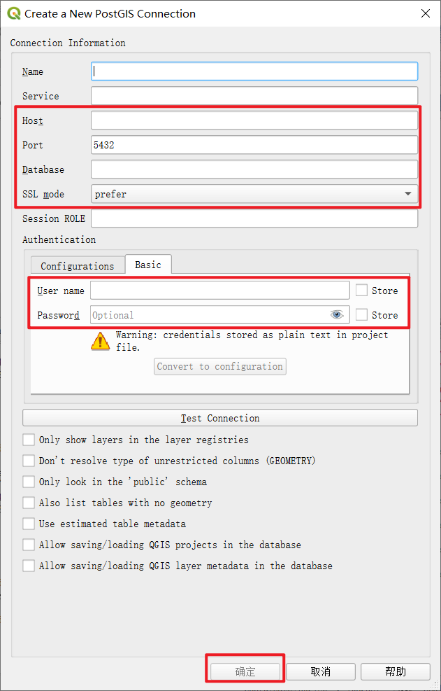
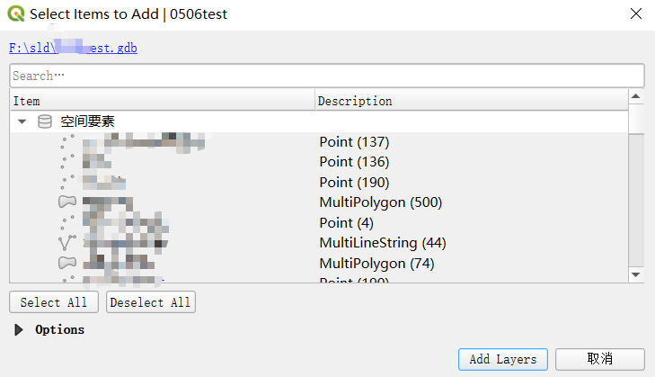
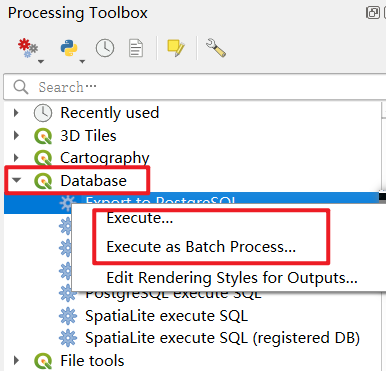
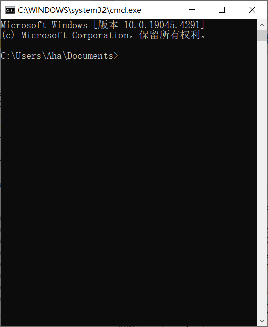

## 准备工作


### 连接PostgreSQL数据库  

`QGIS` 中，`PostgreSQL` 右键打开菜单，点击菜单项 `New Connection` 打开数据库连接创建界面。



### gdb的样子



## 操作  

### 方法一：Toolbox中操作 



:::danger 缺点

你得一个一个将gdb中的所有图层通过qgis导入到postgreSQL中，太麻烦了。

:::

### 方法二： 使用python  

1. 打开`python console`  
2. 弹出命令行窗口  
```py
import os
os.system('cmd.exe') 
```


3. 执行命令  
```md 
ogr2ogr -f "PostgreSQL" PG:"host=xxx.xxx.xx.xxx user=xx password=xxx dbname=xxx" "F:\test.gdb" -overwrite -lco SPATIAL_INDEX=YES -lco LAUNDER=NO -progress
```

:::tip 解释命令
ogr2ogr：命令名  
-overwrite：如果目标表已经存在，则先删除旧表，再重新创建并导入数据。  
-lco LAUNDER=NO：保留字段名的原始大小写格式。  
-lco SPATIAL_INDEX=YES：在导入的几何列上创建空间索引。
:::


### 参考


---
