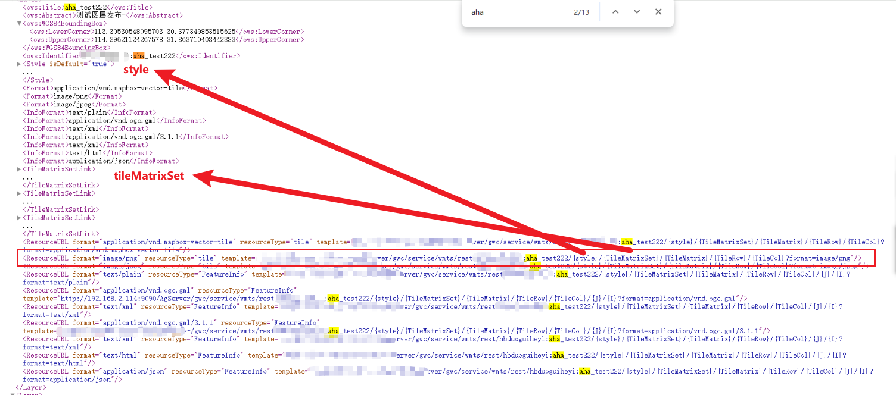
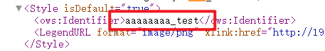
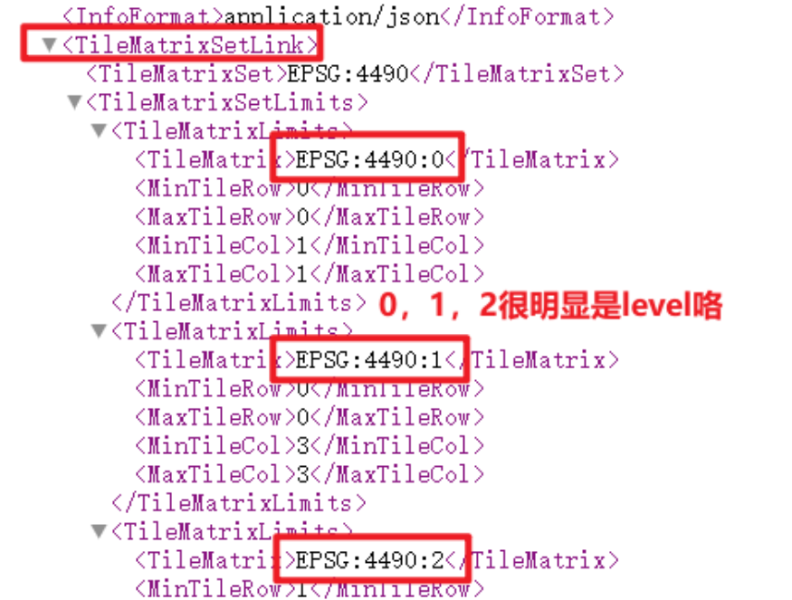
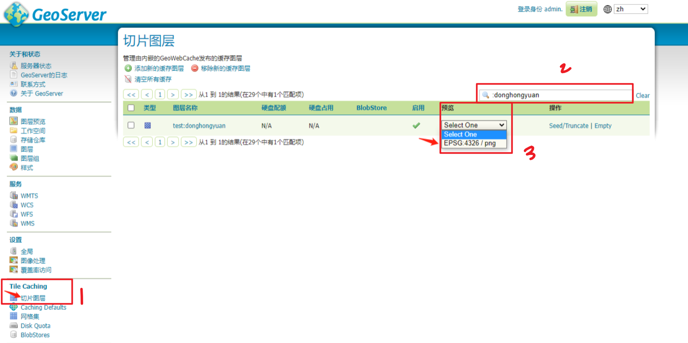
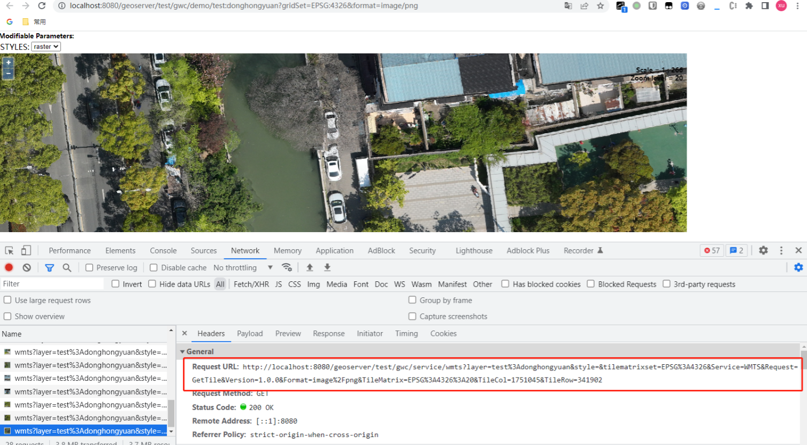
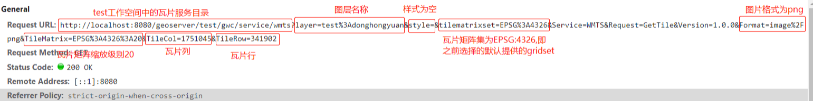
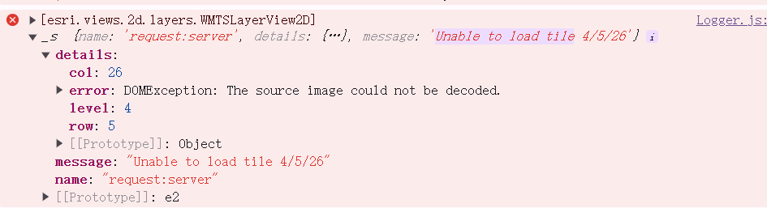
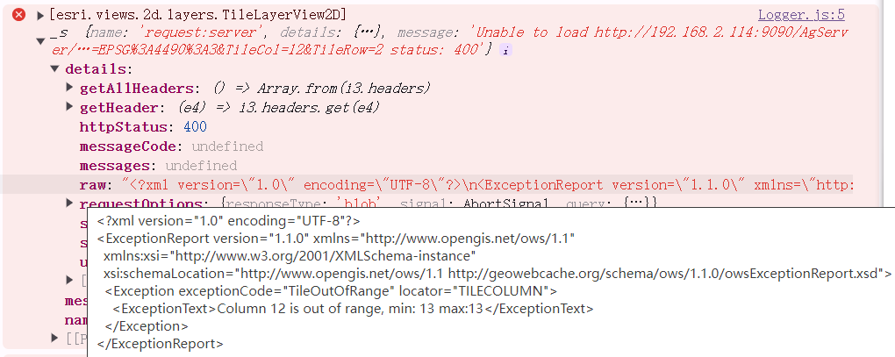

## 怎么确定我在geoserver上发布的服务是wmts呢?  

[geoserver发布图层服务](./geoserver发布图层服务.mdx)


## 怎么找到请求地址,就像请求天地图地址那样?

[参考：ArcGIS API for JavaScript 4.x加载GeoServer发布的WMTS服务](https://www.cnblogs.com/youzi-xuchongyou/p/17337077.html)  


### 方式一：通过 wmts GetCapabilities  


```md
http://xxx.xxx.x.xxx:xxxx/geoServer/gwc/service/wmts?REQUEST=GetCapabilities
```
在浏览器中访问 WMTS 服务的 GetCapabilities URL，以验证配置是否正确。  
👆会展示所有的wmts图层服务。

搜索你想要的那个图层，比如aha  

  


```md 
http://xxx.xxx.x.xxx:xxxx/geoServer/gwc/service/wmts/rest/testt:aha_test222/{style}/{TileMatrixSet}/{TileMatrix}/{TileRow}/{TileCol}?format=image/png
```

- `{style}` 去哪里找呢? 

  

```md 
http://xxx.xxx.x.xxx:xxxx/geoServer/gwc/service/wmts/rest/testt:aha_test222/{style}/{TileMatrixSet}/{TileMatrix}/{TileRow}/{TileCol}?format=image/png

{style} 就替换为aaaaaaa_test
```

- `{TileMatrixSet}` 去哪里找呢? 
tilematrixset

  

```md 
http://xxx.xxx.x.xxx:xxxx/geoServer/gwc/service/wmts/rest/testt:aha_test222/aaaaaaa_test/{TileMatrixSet}/{TileMatrix}/{TileRow}/{TileCol}?format=image/png

{TileMatrixSet} 就替换为 EPSG:4490
{TileMatrix} 替换为 EPSG:4490:{TileMatrix}
```

最后得到：

```md 
http://xxx.xxx.x.xxx:xxxx/geoServer/gwc/service/wmts/rest/testt:aha_test222/aaaaaaa_test/EPSG:4490/EPSG:4490:{TileMatrix}/{TileRow}/{TileCol}?format=image/png

```

你可以写一个TileMatrix、row、col，然后在浏览器上看一眼。


### (推荐)方式二：通过瓦片图层预览  

1. 在geoserver -> 瓦片图层 中预览发布的图层  


  

2. 打开 控制台 看它的请求   

  

3. 打开 控制台 看它的请求   

  

4. 最后得到：

```md 
http://xxx.xxx.x.xxx:xxxx/geoServer/gwc/service/wmts/rest/testt:aha_test222/aaaaaaa_test/EPSG:4490/EPSG:4490:{TileMatrix}/{TileRow}/{TileCol}?format=image/png


http://xxx.xxx.x.xxx:xxxx/geoServer/gwc/service/wmts?layer=图层空间%3A图层名&style=&tilematrixset=EPSG%3A4490&Service=WMTS&Request=GetTile&Version=1.0.0&Format=image%2Fpng&TileMatrix=EPSG%3A4490%3A{TileMatrix}&TileCol={TileCol}&TileRow={TileRow}

// %3A 是冒号。

```


### 总结  

两种方式最终得到的urlTemplate都可以用。


## arcgis for js4 怎么加载wmts? 用WMTSLayer还是WebTileLayer  

### 用WMTSLayer

```js
import WMTSLayer from "@arcgis/core/layers/WMTSLayer.js";
new WMTSLayer({
    // url: "https://gibs.earthdata.nasa.gov/wmts/epsg4326/best", // url to the service
    url: 'http://xxx.xxx.x.xxx:xxxx/geoServer/gwc/service/wmts',

    activeLayer: {
    // id: "SRTM_Color_Index",
    id: '图层空间:图层名',
    }
});
```


  

无解。

看请求是200，但是arcgis解析不了它。  


### 用WebTileLayer  


```js
import WebTileLayer from "@arcgis/core/layers/WebTileLayer.js";

const configData =   {
    id:'3',
    name:'geoserver_wmts_WebTileLayer',
    type: "wmts",
    // urlTemplate: "http://xxx.xxx.x.xxx:xxxx/geoServer/gwc/service/wmts/rest/testt:aha/{style}/{TileMatrixSet}/{TileMatrix}/{TileRow}/{TileCol}?format=image/png",
    // urlTemplate: "http://xxx.xxx.x.xxx:xxxx/geoServer/gwc/service/wmts/rest/testt%3Aaha/testt%3Aahastyle/EPSG%3A4490/EPSG%3A4490%3A{level}/{row}/{col}?format=image/png",
    urlTemplate: "http://xxx.xxx.x.xxx:xxxx/geoServer/gwc/service/wmts?layer=testt%3Aaha&style=&tilematrixset=EPSG%3A4490&Service=WMTS&Request=GetTile&Version=1.0.0&Format=image%2Fpng&TileMatrix=EPSG%3A4490%3A{level}&TileCol={col}&TileRow={row}",
    layerTable:'aha',
    layerType: "geoserverWMTS_WebTileLayer"      
}
new WebTileLayer({
    id: configData.id,
    urlTemplate: configData.urlTemplate,
    tileInfo: tileInfo4490,
    spatialReference: this.view.spatialReference,
    title: configData.name,
});
```


#### tileOutOfRange报错  

  

1. 出现的原因1:查看范围超出影像数据的范围?  

如果是因为查看范围超出了影像数据的范围，这种报错，好像无所谓。

你去查看影像所在的范围，还是能查看到影像的。  

2. 出现的原因2: geoserver的gridset和WebTileLayer的tileInfo没对上  

我测试了geoserver的gridset用4490 ，WebTileLayer的tileInfo用天地图的就会报这个错误。


## TODO: lods   

### 天地图的lods 


### 4490的lods  


