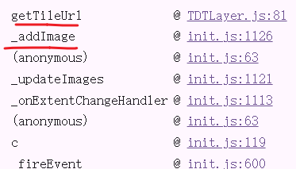
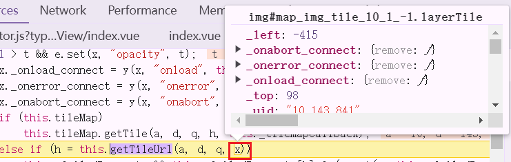
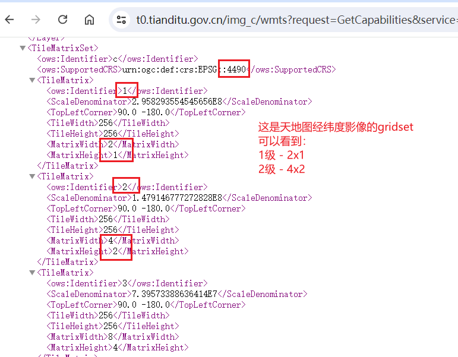
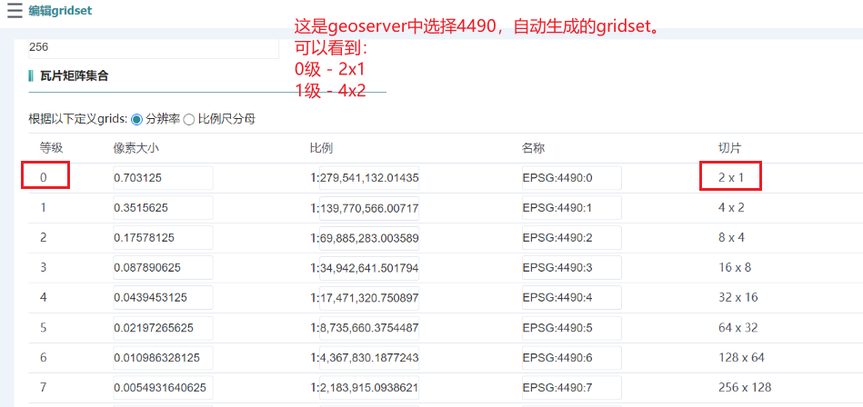

## 一、arcgis js3x 加载天地图时, 如何添加请求头?

### 思路

#### 1

google之后发现 `esriConfig.request.interceptors.push(interceptor);`。
试了发现只有 **arcgis for js4**能用它。

#### 2  
google开始搜 **arcgis for js3**,发现 `esriRequest·setRequestPreCa11back`。
试了发现根本不进这个方法里。

#### 3 

看看谁在调用天地图的请求。  


是源码中的 `_addImage` 中创建了 `img = new Image();img.src = h`, 所以是img标签去请求的天地图。  

(h就是天地图的请求地址，这个地址会去我们封装的天地图类的`getTileUrl` 拿。)  


我缓缓在google中打出了一行字 。。。  

**img标签的src没法设置请求头吗？**  

#### 4  

那我请求下来天地图后，返回给源码中的 `_addImage` 的 `img.src`咯

一顿 `xhr`后，发现异步才能拿到结果啊。但是 `_addImage`是同步的！

我甚至开始想我应该怎么魔改一下源码的`_addImage`方法。  

#### 5  

突然灵光乍现  

```js
getTileUrl: function (level, row, col, element){}
```

这不是现成的 element吗?????


### 代码
```js 
// old：直接把请求地址返回给源码咯
getTileUrl: function (level, row, col, element) {
    return  this._urlTemplate.replace('{z}', level).replace('{x}', col).replace('{y}', row);
}
// new：我自己写请求，最后异步拿到结果复制给element
getTileUrl: function (level, row, col, element) {
    const uu = this._urlTemplate.replace('{z}', level).replace('{x}', col).replace('{y}', row);
      // 使用 XMLHttpRequest 进行自定义请求
      var xhr = new XMLHttpRequest();
      xhr.open('GET', uu, true);
      xhr.responseType = 'blob';
      xhr.setRequestHeader("aaa", "aaa");
      
      xhr.onload = () => {
          if (xhr.status === 200) {
              var reader = new FileReader();
              reader.onloadend = () => {
                  var base64data = reader.result;
                  element.src = base64data
              };
              reader.readAsDataURL(xhr.response);
          }
      };

      xhr.send();
}

```


:::tip 知识点

### 1. 官方文档中gettileurl并没有第四个参数, 但是源码里传了的。

它是img标签。  


     

:::

### 参考
[参考：arcgis js3的官方文档gettileurl](https://developers.arcgis.com/javascript/3/jsapi/tiledmapservicelayer-amd.html#gettileurl)

---


## 二、天地图的 tileInfo.lods 从哪里拿?  

### lods需要的数据  

level: 缩放级别  
scale: 缩放级别对应的比例尺除数  
resolution   


### 天地图 GetCapabilities  

[参考：天地图 GetCapabilities ](https://t0.tianditu.gov.cn/img_c/wmts?request=GetCapabilities&service=wmts)  

👆可以看天地图的TileMatrixSet：4490、18个缩放级别、每个级别的 ScaleDenominator。  

***这里没有resolution***     
 

### 计算 resolution?      

#### ~~网上有一个公式来算~~  

网上有一个公式计算resolution，要用到 scale、dpi、英尺和米的百分比...   

所以是可以用每一级的ScaleDenominator 和 其它常数来计算出一个resolution。  


但是有一个问题：天地图GetCapabilities中给的每一级的ScaleDenominator是加密有偏移的。  

所以你最终算到的数也是不对的。 

除非给你提供解密公式。      


#### 对着geoserver发布的4490gridset来拿咯   

👇可以看出来天地图的lods和4490的lods差一级     





所以tdtdelods可以照着geosever上4490的写咯。只要差一级写就行了。  


### 最终 lods  

```js title="tdt.js"
export const lods = [
  {
      level: 2,
      resolution: 0.3515625,
      scale: 139770566.00717944
  },
  {
      level: 3,
      resolution: 0.17578125,
      scale: 69885283.00358972
  },
  {
      level: 4,
      resolution: 0.087890625,
      scale: 34942641.50179486
  },
  {
      level: 5,
      resolution: 0.0439453125,
      scale: 17471320.75089743
  },
  {
      level: 6,
      resolution: 0.02197265625,
      scale: 8735660.375448715
  },
  {
      level: 7,
      resolution: 0.010986328125,
      scale: 4367830.1877243575
  },
  {
      level: 8,
      resolution: 0.0054931640625,
      scale: 2183915.0938621787
  },
  {
      level: 9,
      resolution: 0.00274658203125,
      scale: 1091957.5469310894
  },
  {
      level: 10,
      resolution: 0.001373291015625,
      scale: 545978.7734655447
  },
  {
      level: 11,
      resolution: 0.0006866455078125,
      scale: 272989.38673277234
  },
  {
      level: 12,
      resolution: 0.0003433227539062,
      scale: 136494.69336636632
  },
  {
      level: 13,
      resolution: 0.0001716613769531,
      scale: 68247.34668318316
  },
  {
      level: 14,
      resolution: 0.0000858306884766,
      scale: 34123.67334161145
  },
  {
      level: 15,
      resolution: 0.0000429153442383,
      scale: 17061.836670805726
  },
  {
      level: 16,
      resolution: 0.0000214576721191,
      scale: 8530.918335382985
  },
  {
      level: 17,
      resolution: 0.0000107288360596,
      scale: 4265.45916771137
  },
  // {
  //     level: 18,
  //     resolution: 0.0000053644180298,
  //     scale: 2132.729583855685
  // },
  // {
  //     level: 19,
  //     resolution: 0.0000026822090149,
  //     scale: 1066.3647919278426
  // },

];


export default {
  // dpi: 96,
  rows: 256,
  cols: 256,
  compressionQuality: 0,
  origin: {
      x: -180,
      y: 90,
  },
  spatialReference: {
      wkid: 4490
  },
  lods,
}
```


### 知识点  

:::tip 知识点

#### 1. resolution  

1. resolution：1像素代表的实际距离。    

2. 另一种计算方式： 

拿x轴来算： x/(256*2^level)  

经度360°，瓦片大小是256，

例如：层级0使用了一个瓦片，层级1使用了4个瓦片。层级0和层级1表示的地球范围都是一样的经度[-180, 180]，纬度[-90, 90]。
在层级0的时候，一个像素就表示360/256 = 1.40625这么长的经度范围，这个数就是分辨率，即一个像素所表示的范围是多少。


```md title="计算resolution"
TileMatrixSet>
    <ows:Identifier>c</ows:Identifier>
    <ows:SupportedCRS>urn:ogc:def:crs:EPSG::4490</ows:SupportedCRS>
    <TileMatrix>
        <ows:Identifier>1</ows:Identifier>
        <ScaleDenominator>2.958293554545656E8</ScaleDenominator>
        <TopLeftCorner>90.0 -180.0</TopLeftCorner>
        <TileWidth>256</TileWidth>
        <TileHeight>256</TileHeight>
        <MatrixWidth>2</MatrixWidth>
        <MatrixHeight>1</MatrixHeight>
    </TileMatrix>
    <TileMatrix>
        <ows:Identifier>2</ows:Identifier>
        <ScaleDenominator>1.479146777272828E8</ScaleDenominator>
        <TopLeftCorner>90.0 -180.0</TopLeftCorner>
        <TileWidth>256</TileWidth>
        <TileHeight>256</TileHeight>
        <MatrixWidth>4</MatrixWidth>
        <MatrixHeight>2</MatrixHeight>
    </TileMatrix>

    level:1
    resolution = 360/(256*2**1) = 0.703125

    level:2
    resolution = 360/(256*2**2) = 0.3515625


```

:::


### 参考  

[ArcGIS API for Javascript 4.5 加载天地图WMTS服务示例 ](https://github.com/baxtergu/arcgis-jsapi4-load-tianditu-wmts-service)  

---


