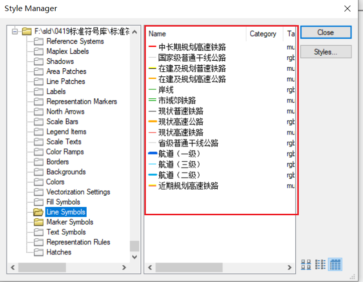
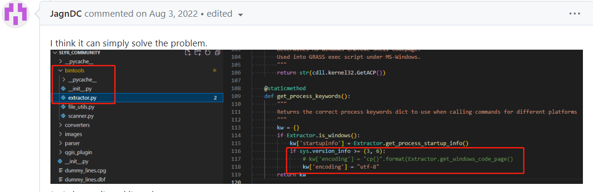
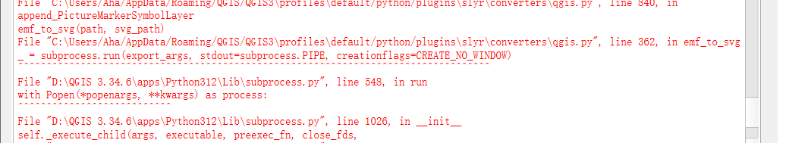
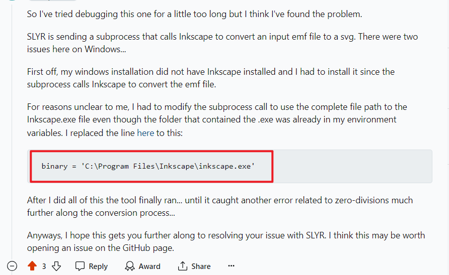

### 思路  

#### 1

想用arcpy直接写代码读，然后直接写成sld。

发现做不到。因为我只有arcmap没有arcgis pro，所以用很古老的 arcpy.mapping.ListStyleItems。  

这个接口只能拿样式的名称、样式的类型，拿不到填充色啊，实际符号啊，线宽啊。。。

#### 2  

google狂搜。
发现可以在 qgis 种用 [SLYR](https://north-road.com/slyr/) 插件。  

行，那就用。  

### 准备工作  

#### 1 看一眼style长什么样子    

arcmap 10.6 -> customize -> style manager  

  

#### 1 电脑有 qgis  

#### 2 下载 slyr 插件 

参考： [Converting ESRI Styles To QGIS XML Using SLYR](https://opengislab.com/blog/2019/3/16/converting-esri-styles-to-qgis-styles-using-slyr)  

1. 在github中下载社区版.zip [slyr(社区版)](https://github.com/north-road/slyr/releases/tag/2.0)  

2. qgis中 plugins -> manage and install plugins -> install from ZIP  

3. slyr需要安装 mdbtools，直接github中下载就行。  

4. toolbox -> options -> processing -> providers -> slyr 加上mdbtools 目录。  

5. 可以使用了。

### 修复slyr 使用中报错

使用的时候会报错。  

:::danger

#### 1 UnicodeDecodeError: 'utf-8' codec can't decode byte 。。。  ?   

[参考 can not use “convert ESRI style to QGIS stye XML" ](https://github.com/north-road/slyr/issues/130)  

根据报错信息去修改源码就行，（凑合用吧）  

  

#### 2 简单样式没问题了,但是有图片的样式会报错 。。。 ? 

  

 [参考](https://www.reddit.com/r/gis/comments/b0ywud/convert_style_to_qgis_xml/)  

所以去[官网](https://inkscape.org/release/inkscape-1.3.2/windows/64-bit/msi/?redirected=1)下载 **inkscape**，
然后将地址贴到源码上就行了。  

:::

###   end  

到此 可以使用slyr将esri的.style文件转为 xml文件了。  

里面有很多信息，如果后续要生成sld文件，可以用python来处理。。。

---

